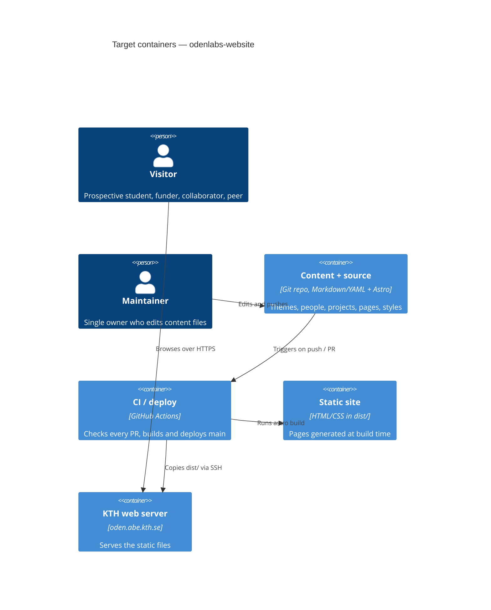

# Architecture map — odenlabs-website

> **Target foundation** (greenfield-bootstrap), produced by `survey` on 2026-10-04 and read by
> specify / design / implement. The HugoBlox starter at `reflects_commit` is **not** the
> architecture — it is removed by `/sdd:scaffold` (idea-brief §1). Once the skeleton exists, re-run
> `survey` to turn this into a map of what is actually there.

## Stack

- Language / runtime: TypeScript on Node (current LTS, pinned in `.nvmrc`) — ADR [0001](adr/0001-build-the-site-with-astro-as-a-static-site.md)
- Frameworks: Astro (latest stable), static output only (`output: "static"`), no UI framework islands
- Package manager: npm (lockfile `package-lock.json` committed; CI runs `npm ci`)
- Build / test / lint:
  - `npm run build` → `astro build` into `dist/`
  - `npm test` → `vitest run` (unit tests + the build smoke test)
  - `npm run lint` → `astro check && prettier --check .` (types + content schema + formatting)
- Site URL: `https://oden.abe.kth.se/` in `astro.config.mjs` `site` (final domain still open — roadmap D3)

## C4 — system as it is

Target baseline: a static site built in CI and copied to the KTH server.

## Module inventory

A content site, not a service: the "modules" are Astro's standard folders.

| Module | Path | Layers | Wired at | Responsibility |
|---|---|---|---|---|
| Content | `src/content/{themes,people,projects}/` | data | `src/content.config.ts` | One Markdown/YAML file per entry; file name = ID |
| Content schema | `src/content.config.ts` | schema | Astro content layer | Zod schemas + cross-references between collections |
| Pages | `src/pages/` | routes | file-based routing | One file per route; dynamic routes via `getStaticPaths` |
| Layouts | `src/layouts/` | ui | imported by pages | `Base.astro`: head, header/nav, footer |
| Components | `src/components/` | ui | imported by pages/layouts | Reusable cards, lists, nav |
| Styles | `src/styles/` | ui | imported once in `Base.astro` | `tokens.css` (design tokens) + `global.css` |
| Lib | `src/lib/` | logic | imported by pages | Pure helpers (e.g. "people in theme X"), unit-tested |
| Static assets | `public/` | assets | served as-is | Logo, favicon, member photos |
| Tests | `tests/` | test | `vitest.config.ts` | Unit tests for `src/lib` + build smoke test |

## Conventions (cited — the rules a new feature must match)

Materialized by `/sdd:scaffold` on 2026-10-04; also stated in `CLAUDE.md`.

- **Module wiring / registration:** file-based routing; a new page type is a file in `src/pages/`, a new content type is a collection in `src/content.config.ts`.
- **Error handling:** fail the build, never the visitor. Invalid content (bad schema, dangling reference) must make `astro check` / `astro build` fail; no runtime error paths, because nothing runs at request time. Astro 7 only *logs* dangling `reference()` IDs, so `src/layouts/Base.astro` calls `assertContentIntegrity()` (`src/lib/content-integrity.ts` → `src/lib/references.ts`), which throws during the build.
- **IDs:** the entry's file name in kebab-case (`people/jane-doe.md` → `jane-doe`); cross-links use Astro `reference()` to these IDs. ADR [0002](adr/0002-keep-content-as-typed-files-in-git.md).
- **Persistence / DB access:** none. Content collections read from the filesystem at build time; external data (publications, step 7) arrives as a generated file under `src/data/`, never fetched at request time.
- **Migrations:** none (no database). Changing a schema is a code change; `astro check` reports every entry that no longer conforms.
- **Tests:** Vitest; `tests/*.test.ts`. Pure helpers in `src/lib` get unit tests; `tests/build.test.ts` is the smoke test (build succeeds, `dist/index.html` exists).
- **Inter-module communication:** pages call `getCollection()` / `getEntry()` and helpers in `src/lib`; no client-side JS unless a feature needs it.
- **UI / styling:** plain CSS with custom properties from `src/styles/tokens.css`; component styles in scoped `<style>` blocks inside `.astro` files that only use tokens, never raw colours. ADR [0003](adr/0003-style-with-plain-css-custom-properties.md).
- **Formatting:** Prettier with `prettier-plugin-astro`; `.editorconfig` (2-space, LF) kept.
- **Language:** English only (idea-brief §5); no i18n setup.

## Datastores

| Store | Engine | Accessed via | Notes |
|---|---|---|---|
| Content files | Markdown/YAML in git | Astro content collections | The only store; history = git history |
| Publications (future, step 7) | Generated JSON in `src/data/` | Astro `file()` loader | Source decided in roadmap D2 |

## Frontend / UI foundation

- **Component library / design system:** in-repo only, `src/components/` + `src/layouts/Base.astro`; no third-party UI kit.
- **Design tokens:** `src/styles/tokens.css`, seeded from the existing identity: logo navy `#004790` and grey `#666` (`assets/media/logo.svg`), plus the blue/cyan scales in `assets/css/themes/blue.css`. Restyle = edit this file.
- **Styling approach:** vanilla CSS custom properties + Astro scoped styles. No Tailwind (ADR 0003).
- **Shared primitives:** to be created by scaffold: `Base.astro` (layout), `Header.astro` (logo + nav: Research · People · Join/Contact), `Footer.astro`.
- **State / data-fetching:** none at runtime; all data resolved at build time.
- **Closest UI precedent:** none yet. After scaffold, `src/pages/index.astro` on `Base.astro` is the precedent.

## Where things live / closest precedents

- A new content type (e.g. projects) → a collection in `src/content.config.ts` + entries in `src/content/<type>/` + list and detail pages in `src/pages/<type>/index.astro` and `[id].astro`.
- A new standalone page (e.g. Join/Contact) → `src/pages/<name>.astro` (or `.md` with a layout), using `Base.astro`.
- A new screen / UI component → `src/components/<Name>.astro`, styled only with tokens from `tokens.css`.
- Cross-entity logic (e.g. "projects under theme X") → a pure function in `src/lib/` with a Vitest test.

## Constraints & known tech-debt

- **Deploy target:** GitHub Actions copies `dist/` over SSH to `oden.abe.kth.se` using four existing repo secrets (`SSH_HOST`, `SSH_USERNAME`, `SSH_PRIVATE_KEY`, `SSH_TARGET_DIR`). The server only serves static files: no server-side code, no Node at runtime.
- **Domain not final:** roadmap D3; `site` in `astro.config.mjs` is the one place to change.
- **Starter to delete:** HugoBlox files (`config/`, `content/`, `assets/scss/`, `static/`, `go.mod`, `go.sum`, `netlify.toml`, `theme.toml`, `preview.png`, `.github/FUNDING.yml`, `.github/workflows/import-publications.yml`); keep `assets/media/logo.svg`, `assets/media/icon.png` and the colour values (moved under `public/` and `src/styles/`).
- **Single maintainer:** prefer fewer dependencies over convenience; every new dependency needs a reason.

## Reconciliation with the authored architecture doc

No authored architecture doc; this map is the current reference. The starter `README.md` describes HugoBlox and is replaced by scaffold.
