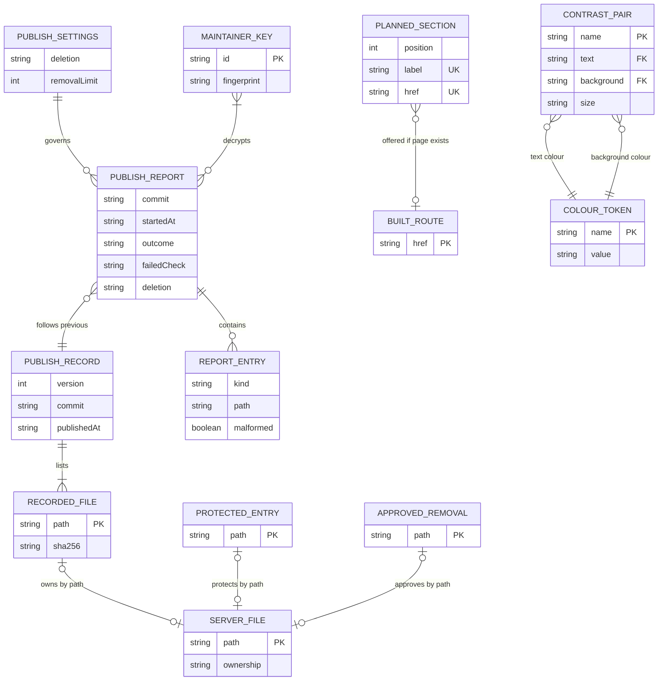

# Data model — clean-starter

> **There is no database.** Content is typed files in git (repo ADR
> [0002](../../adr/0002-keep-content-as-typed-files-in-git.md)), `migration_tool: "none"` in
> [`architecture-map.md`](../../architecture-map.md), and the SAD §6 confirms "no database, table or
> index". The only state outside git is the shared server folder (sad §2). This document therefore
> models the feature's **file-based entities**: their shapes, invariants, owners and the lookups
> that read them. **No SQL migrations are staged** (see "Migrations" below). Field types use
> TypeScript vocabulary, the language that reads and writes every file.

## ER diagram

Where each entity lives:

| Entity | Lives in | Written by | Read by | Persisted? |
|---|---|---|---|---|
| `PUBLISH_RECORD` + `RECORDED_FILE` | `<SSH_TARGET_DIR>/.publish-record.json` | `remote/swap.sh`, last step of every publish (ADR-0002, ADR-0003) | `deploy/plan.ts` on the next publish | Yes, on the server |
| `SERVER_FILE` | the live listing of `<SSH_TARGET_DIR>` | — (observed) | `deploy/plan.ts` | No: derived per publish |
| `PROTECTED_ENTRY` | `deploy/rules/protected.txt` | maintainer, through a reviewed PR (ADR-0005) | `deploy/plan.ts` | Yes, in git |
| `APPROVED_REMOVAL` | `deploy/rules/approved-removals.txt` | maintainer, through a reviewed PR | `deploy/plan.ts` | Yes, in git |
| `PUBLISH_SETTINGS` | `deploy/rules/settings.json` | maintainer, through a reviewed PR | `deploy/plan.ts` | Yes, in git |
| `MAINTAINER_KEY` | `deploy/maintainers/<id>.asc` | maintainer, through a reviewed PR | `deploy/report.ts` | Yes, in git |
| `PUBLISH_REPORT` + `REPORT_ENTRY` | GPG-encrypted workflow artifact | `deploy/report.ts` (ADR-0004) | maintainers, after decrypting | Yes, artifact retention (90 days by default) |
| `PLANNED_SECTION` | `src/data/sections.ts` | maintainer | `src/lib/navigation.ts`, publish summary (AC-04) | Yes, in git |
| `BUILT_ROUTE` | `src/pages/` at build time; `dist/` at publish time | — (derived) | `offeredSections()`, publish summary | No: derived |
| `CONTRAST_PAIR` | `src/styles/contrast-pairs.ts` | maintainer | `tests/contrast.test.ts` | Yes, in git |
| `COLOUR_TOKEN` | `src/styles/tokens.css` | maintainer | `tests/contrast.test.ts`, every component | Yes, in git |

The existing content collections (`themes`, `people`, `projects` in `src/content.config.ts`) are
**not changed** by this feature.

## Shared rule: server paths

Every `path` field in the publish worker follows sad §8 "ID strategy". A path is relative to
`SSH_TARGET_DIR`, uses `/` separators, and has no leading `/`, no `.` or `..` segment, no empty
segment, and no control character (including newline). One normaliser in `deploy/plan.ts` owns
this rule. Paths are compared byte-for-byte after normalisation and are **case-sensitive**, as
on the server's file system.

A malformed path on a **build, owned, approved or protected** entry stops the publish (failed
check `malformed-path`). A malformed path on an **unknown** server file is reported with
`malformed: true` and never acted on, so it cannot block a publish (AC-13, sad §11).

Two paths are always outside the listing and never classified: `.publish-record.json` (the
record itself, replaced by every publish) and everything under `.publish-staging/` (transient,
ADR-0003).

## Entities — aggregate: publish ownership (worker surface)

The aggregate root is the **publish record**. It alone decides which server files the site owns
(ADR-0002). The rules files and the live listing are inputs that the planner joins against it
by path.

### `PUBLISH_RECORD` — `.publish-record.json`

| Field | Type | Constraints | Notes |
|---|---|---|---|
| `version` | `1` | required, literal | Format version. ADR-0002 says a format change needs the planner to read both versions for one publish. This field is how it tells them apart. ⚑ added by data-model |
| `commit` | `string` | required, 40 hex characters | The source commit of the publish (ADR-0002) |
| `publishedAt` | `string` | required, ISO 8601 UTC | When the record was written, at the end of the swap |
| `files` | `RecordedFile[]` | required, non-empty, unique by `path`, sorted by `path` | Every path the publish uploaded. Sorting keeps the file diffable between publishes |

**Invariants.** `files` contains `index.html` and `logo.svg` (AC-12: a record without the front
page and logo counts as no matching record). The record never lists itself or anything under
`.publish-staging/`. It is written **last** by `swap.sh`, through write-to-temp-then-rename, so a
publish interrupted before that step leaves the previous record intact (ADR-0003).

**Absent record.** On the first publish the file does not exist. With deletion off this is
allowed, and that publish writes the first record (sad §4, rollout step 2). With deletion on it
is the AC-12 failed check `no-previous-record`.

**Unreadable record** (invalid JSON, unknown `version`, a field breaking the constraints above):
treated as **no matching record**, so with deletion on the publish stops before deleting
(AC-12). With deletion off the publish goes ahead, writes a fresh record and reports a warning.

### `RECORDED_FILE` — element of `PUBLISH_RECORD.files`

| Field | Type | Constraints | Notes |
|---|---|---|---|
| `path` | `string` | required, normalised server path, unique within the record | Key that `SERVER_FILE` joins on |
| `sha256` | `string` | required, 64 lowercase hex characters | Hash of the uploaded bytes (ADR-0002). Used by the post-publish check and for repair after an interrupted swap (ADR-0003) |

**Aggregate root:** `PUBLISH_RECORD`.

### `SERVER_FILE` — one entry of the live listing (derived)

| Field | Type | Constraints | Notes |
|---|---|---|---|
| `path` | `string` | as listed by the server (NUL-separated, sad §8), normalised if valid | |
| `ownership` | `"owned" \| "approved" \| "protected" \| "unknown"` | exactly one; computed by the planner | |
| `inBuild` | `boolean` | computed | Whether the build has a file at this path |

**Classification order** (sad §8 "Ownership", ADR-0002): `protected` first, then `owned` (in the
previous record), then `approved`, else `unknown`. Protected wins, so a protected file is never
removed even if a stale record or an approval also names it (AC-11).

**What the planner does with it:**

| `ownership` | `inBuild` | Deletion off | Deletion on |
|---|---|---|---|
| protected | yes | stop: `protected-clash` (AC-11b) | stop: `protected-clash` (AC-11b) |
| protected | no | leave unchanged | leave unchanged (AC-11) |
| owned / approved | yes | overwrite with the build file | overwrite with the build file |
| owned / approved | no | list for review, keep | remove (AC-10, AC-01) |
| unknown | no | list for review, keep | keep, report (AC-13) |
| unknown | yes | overwrite; it becomes owned | overwrite; it becomes owned |

"Unknown + inBuild" (a file the site never published, at an address the build now uses) is
decided as **overwrite**, which is what today's upload-only publish does. The report names the
path as `uploaded` and, for that one publish, also as a `warning` ("replaced a file the site
never published"), so the maintainer sees it. It is not a stop, so it cannot trip the
false-alarm KPI (spec §7). Decided by the maintainer on 2026-10-04 during `tasks`.

### `PROTECTED_ENTRY` — a line of `deploy/rules/protected.txt`

| Field | Type | Constraints | Notes |
|---|---|---|---|
| `path` | `string` | normalised server path, unique within the file | One path per line, UTF-8, LF |

**File grammar** (shared with `approved-removals.txt`): one path per line. Blank lines are
ignored. A line whose first character is `#` is a comment, so the maintainer can record why a
file is kept. No globs: each entry names exactly one file, which keeps "an approval of a list
that differs by even one file does not count" (AC-12) checkable. A duplicate or malformed line
fails the **check job**, so a bad rules file never reaches a publish.

**Aggregate root:** standalone rule list. Its owner is the maintainer, via CODEOWNERS (ADR-0005).

### `APPROVED_REMOVAL` — a line of `deploy/rules/approved-removals.txt`

| Field | Type | Constraints | Notes |
|---|---|---|---|
| `path` | `string` | normalised server path, unique within the file | Same grammar as `protected.txt` |

**Invariant:** a path may not appear in both `protected.txt` and `approved-removals.txt`. The
check job fails with `rules-conflict` and names the path. ⚑ added by data-model; spec and SAD
leave the overlap undefined, and the protected-first classification would otherwise silently
ignore the approval.

**Exact-match rule (AC-12):** when the planned removals exceed `removalLimit`, the set of planned
removals must **equal** the set of approved removals that are still present on the server.
Otherwise the publish stops with `removal-limit`. Approved entries already gone from the server are
ignored, so a stale approval does not block a later publish. It is reported as a warning so the
maintainer can prune the file.

### `PUBLISH_SETTINGS` — `deploy/rules/settings.json`

| Field | Type | Constraints | Notes |
|---|---|---|---|
| `deletion` | `"on" \| "off"` | required | The deletion switch. Starts `"off"` (sad §4) |
| `removalLimit` | `20` | required, literal | The routine removal limit (spec §6). It must equal the spec value (sad §11), so the schema pins it. Changing it is a spec change first |

Unknown keys fail validation, so a mistyped `"deleteion"` cannot leave the switch at a default.
Validation runs in the check job, so a bad settings file never reaches the deploy job.

### `MAINTAINER_KEY` — `deploy/maintainers/<id>.asc`

| Field | Type | Constraints | Notes |
|---|---|---|---|
| `id` | `string` | file name without `.asc`, kebab-case | Repo convention: IDs are file names |
| `fingerprint` | `string` | read from the armoured key at load | Logged publicly (fingerprints are public), so maintainers can see which keys a report was encrypted to |

**Invariant:** at least one key must exist and be usable for encryption. Otherwise the publish
stops before any upload (ADR-0004, Flow 5).

### `PUBLISH_REPORT` — the encrypted artifact (ADR-0004)

| Field | Type | Constraints | Notes |
|---|---|---|---|
| `commit` | `string` | 40 hex characters | |
| `startedAt` | `string` | ISO 8601 UTC | |
| `deletion` | `"on" \| "off"` | | Switch value in force for this publish |
| `outcome` | `"in-progress" \| "published" \| "stopped" \| "failed-before-swap" \| "failed-during-swap" \| "post-check-failed"` | required | `in-progress` = the interim report sealed before upload; `stopped` = a planner guard failed and the server is untouched; `failed-before-swap` = upload or a swap pre-check failed, server untouched; `failed-during-swap` = the swap began and failed |
| `failedCheck` | `FailedCheck \| null` | set iff `outcome` is neither `published` nor `in-progress` | Closed set, below |
| `entries` | `ReportEntry[]` | | The server listing plus outcome lists |
| `swapSeconds` | `number \| null` | | Mixed-version window measured by `swap.sh` (≤ 5 s target) |
| `unreadableFolders` | `number` | ≥ 0 | Folders the listing could not read; a count only, also shown publicly |

`FailedCheck` is a closed set: `missing-front-page`, `missing-logo`, `no-previous-record`,
`record-without-front-page-or-logo`, `removal-limit`, `protected-clash`, `malformed-path`,
`no-maintainer-key`, `encryption-failed`, `remote-tools-missing`, `layout-clash`, `listing-failed`, `upload-failed`, `swap-failed`,
`post-publish-check`. The
**public** job summary carries only these names and counts per `ReportEntry.kind` (sad §8
"Logging and disclosure").

### `REPORT_ENTRY` — element of `PUBLISH_REPORT.entries`

| Field | Type | Constraints | Notes |
|---|---|---|---|
| `kind` | `"uploaded" \| "removed" \| "unknown" \| "protected" \| "approved-pending" \| "owned-pending" \| "warning"` | required | `*-pending` = would be removed with deletion on (the review listing, AC-07) |
| `path` | `string` | raw name for `unknown`; normalised otherwise | Never written outside the encrypted report |
| `malformed` | `boolean` | default `false` | Only `unknown` entries can be `true` |
| `message` | `string` | `warning` only | e.g. "navigation entry /people/ points to a missing page" (AC-04) |

**Aggregate root:** `PUBLISH_REPORT`.

## Entities — aggregate: site navigation and identity (web-frontend surface)

### `PLANNED_SECTION` — element of `src/data/sections.ts`

| Field | Type | Constraints | Notes |
|---|---|---|---|
| (position) | array index | | Planned order (AC-03) |
| `label` | `string` | non-empty, unique | Planned label shown in the navigation |
| `href` | `string` | starts and ends with `/`, unique, internal only | Matches the trailing-slash form Header.astro uses today |

Initial value, moved unchanged out of `src/components/Header.astro`:
`Research → /research/`, `People → /people/`, `Join/Contact → /join/`.

**Derived:** an **offered section** is a planned section whose `href` resolves to a page:
`src/pages` at build time (`offeredSections()`, AC-03), and `dist/<href>index.html` at publish
time (the AC-04 warning). The two checks use the same href→file rule, defined once in
`src/lib/navigation.ts`.

### `CONTRAST_PAIR` — element of `src/styles/contrast-pairs.ts`

| Field | Type | Constraints | Notes |
|---|---|---|---|
| `name` | `string` | unique | Named in the failure message (AC-06) |
| `text` | token name | must resolve in `tokens.css` | e.g. `--color-text-muted` |
| `background` | token name | must resolve in `tokens.css` | e.g. `--color-bg` |
| `size` | `"body" \| "large" \| "ui"` | required | Minimum: body 4.5:1; large and ui 3:1 (spec §6, WCAG 2.1 AA) |

### `COLOUR_TOKEN` — a custom property in `src/styles/tokens.css`

| Field | Type | Constraints | Notes |
|---|---|---|---|
| `name` | `string` | `--color-*` | |
| `value` | `string` | a hex colour, or `var(--color-*)` that resolves to one | Aliases chain today (`--color-text-muted: var(--color-brand-muted)`), so the test resolves `var()` recursively and fails on a cycle or a missing target |

## Indexes

N/A: there is no database. Every lookup is an in-memory set or map built per run, sized by the
site's file count (≈ 2,000 files at the sad §7 scaling threshold).

| Lookup | Built from | Query it serves |
|---|---|---|
| set of build paths | `dist/` file list | "is this server file in the build?" (Flows 1 and 5; AC-10, AC-11b) |
| map path → `sha256` | `PUBLISH_RECORD.files` | ownership and the post-publish hash check (ADR-0002, ADR-0003) |
| set of protected paths | `protected.txt` | protected-first classification (AC-11, AC-11b) |
| set of approved paths | `approved-removals.txt` | removal eligibility and the exact-match rule (AC-01, AC-12) |
| set of built routes | `src/pages` / `dist/` | offered sections and the AC-04 warning (Flow 3) |

## Migrations

**None staged.** `migration_tool: "none"`, and nothing in this feature changes a database. The
file formats above change through ordinary reviewed code changes. The one format that crosses
publishes, `.publish-record.json`, carries `version: 1`, so a later format change can follow
ADR-0002's "read both versions for one publish" rule. The first publish creates the record, so
there is no bootstrap step either: the record's absence with deletion off is the bootstrap state.

## Test fixtures

Fixtures are TypeScript builders in `tests/fixtures/publish.ts`, used by `plan.test.ts` and
`swap.test.ts`. They are not migrations or seeds.

- `buildFiles(paths?)` — a build file list. Defaults to `index.html`, `404.html`, `logo.svg`,
  `icon.png` and one content-hashed `_astro/*.css`.
- `publishRecord(overrides?)` — a valid version-1 record with commit
  `0000000000000000000000000000000000000000`, a fixed `publishedAt`, and files matching
  `buildFiles()`. Variants: no record, unreadable JSON, unknown version, a record without
  `index.html` or `logo.svg`.
- `serverListing({ owned, protected, approved, unknown })` — a NUL-separated listing. It includes
  odd unknown names (a newline, a leading `-`, non-ASCII) for the malformed-path cases.
- `rules({ protected, approved, deletion })` — the three rules files. `removalLimit` is always 20.
- `starterFiles(n)` — `n` neutral starter-like paths (`post/demo-<n>/index.html`), to test the
  20 versus 21 removal boundary and the off-by-one approved list.
- `maintainerKey()` — a throwaway GPG key generated in the test's temp keyring, with uid
  `Test Maintainer <maintainer@example.test>`. No real key or address appears in fixtures.
- `tempServerFolder(listing)` — seeds a temp directory for `swap.test.ts`, recording the bytes and
  timestamps of protected and unknown files so the test can assert they are unchanged.
- `contrastPairs(...)` and `sections(...)` — small inline literals in `contrast.test.ts` and
  `navigation.test.ts`. No shared builder is needed.
