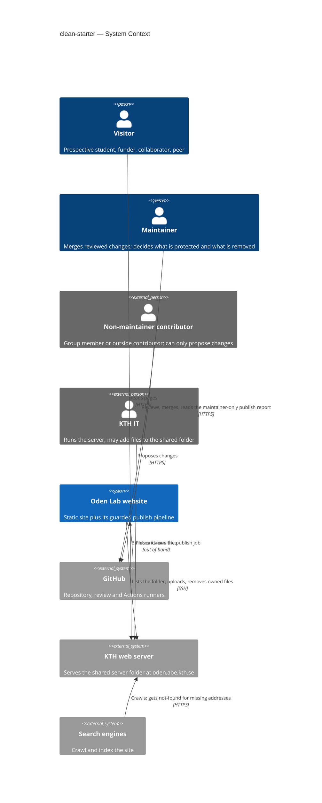
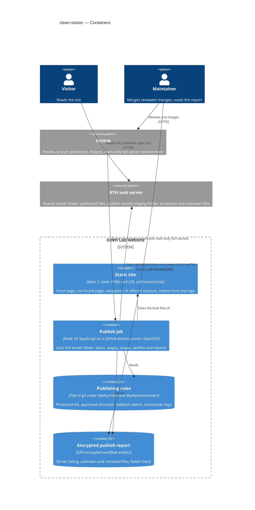
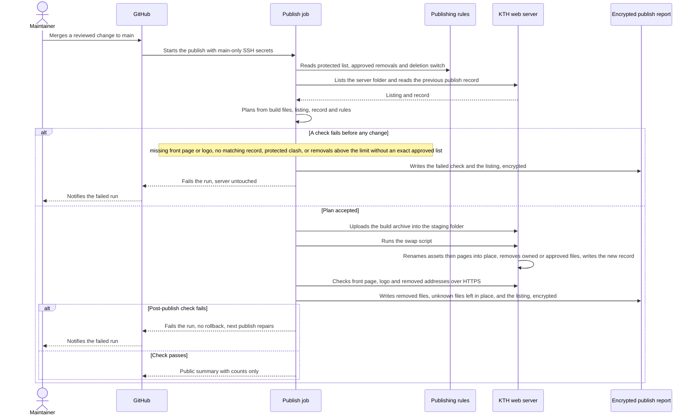
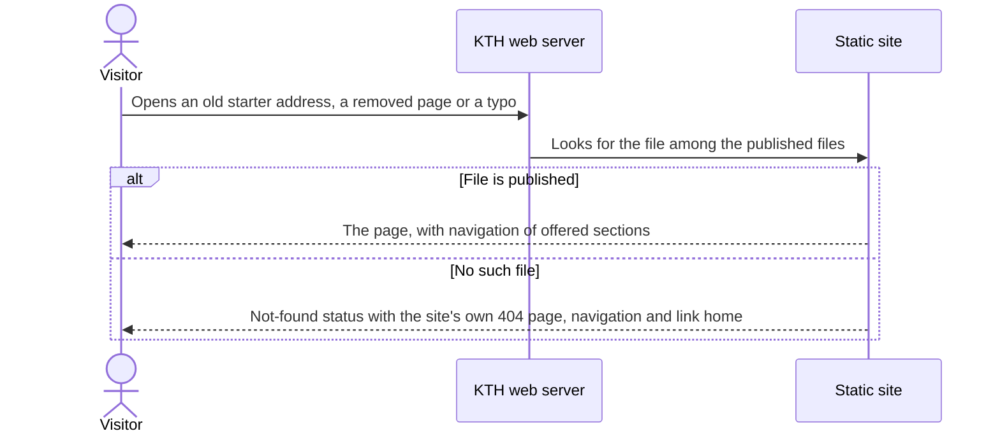

# Software Architecture Document — clean-starter

<!-- 12 Arc42 sections. Empty section → <!-- N/A: <one-line reason> -->. -->
<!-- C4 Context (L1) lives inline in §3. C4 Container (L2) lives inline in §5. -->
<!-- Numbers in §10 come VERBATIM from spec.md §6 NFR — no inventing, no rounding. -->

## 1. Introduction and goals

<!-- 🎯 Why: durable memory of «what + the three dominant qualities + who cares». A year from
     now nobody recalls which three qualities were critical for this system.
     📋 Write: 1 ¶ intent + 3 lines of top-3 quality goals + a stakeholders table.
     ¶4 is the override slot — critic `Override` resolutions emit «Decision override: <headline>
     — rationale: <reason>» bullets here so downstream skills see the deliberate choice. -->

**Intent.** Replace the starter that oden.abe.kth.se still serves with a minimal, honest front
page in the group's own identity, and turn publishing into a safe mirror. The live site reflects
what the maintainer publishes, a publish removes only files the site itself published or the
maintainer approved, and it stops before deleting anything when the build or the target folder
looks wrong. The feature serves visitors (prospective students, funders, peers), who must see only
real content, readable and with no dead ends. It also serves the maintainer, who must be able to
publish in minutes without manual server work and without endangering files others rely on in
the shared university server folder. It covers roadmap step 1, the starter-cleanup half of step 8
and a minimal slice of step 2 (spec §1).

**Top quality goals (1-liners; full scenarios in §10):**

1. **Safety of the shared server folder.** A publish never changes a protected file, never deletes
   a file it does not own or that was not approved, and stops before deleting when the build or
   folder looks wrong. Routine removals are capped at ≤ 20 files per publish.
2. **An accurate mirror.** What is live equals what was last published. 100% of the reviewed
   starter addresses show the not-found page, and no navigation entry leads nowhere.
3. **Readable and self-contained pages.** Text meets ≥ 4.5:1 (body) / ≥ 3:1 (large text, UI)
   contrast, pages make 0 third-party requests, and fonts weigh ≤ 100 KB per page.
4. **A fast, consistent publish.** Merge to live takes ≤ 10 min, and visitors can receive a mix
   of old and new files for ≤ 5 s.

**Stakeholders.**

| Role | Interest | Sign-off owner? |
|---|---|---|
| visitor | Sees only real group content, readable, with no dead ends (US-01–US-04, US-08) | No |
| maintainer | Publishes in minutes; reviews the server listing; decides what is protected and what is removed (US-05–US-07) | Yes — accepts the before/after identity screenshot and every removal approval |
| Non-maintainer contributor (group member or outside contributor) | May propose changes; must never change the live site or the publishing rules unreviewed (AC-08) | No |
| KTH IT | Runs the server and may place files in the shared folder; those files must survive (AC-13) | No |
| Tech Lead | SAD approval | Yes |
| Security Lead | Required security review — first time a publish deletes files on a shared university server (spec §6.1) | Yes |

<!-- Decision overrides (¶4) — populated by the critic resolution loop, empty otherwise. -->

## 2. Constraints

<!-- 🎯 Why: §4 strategy only works when §2 has fixed WHAT IS ALREADY FIXED — stack, versions,
     deadline, regulatory. This is an input, not an output.
     📋 Write: four blocks — Technical / Organisational / Conventions / Regulatory.
     📌 Pin versions («<datastore> 18», not «<datastore>»); «Q3 deadline — hard», not «ideally».
     Never N/A — every feature inherits at least Conventions + Technical. -->

**Technical.**
- TypeScript on Node ≥ 24 (`package.json` `engines`, version pinned in `.nvmrc`); npm with a
  committed lockfile, `npm ci` in CI.
- Astro 7 (`astro ^7.3.5`), `output: "static"`, with no UI-framework islands (repo ADR
  [0001](../../adr/0001-build-the-site-with-astro-as-a-static-site.md)). Vitest 5, `@astrojs/check`
  and Prettier 3 with `prettier-plugin-astro`.
- No database. Content is typed files in git (repo ADR
  [0002](../../adr/0002-keep-content-as-typed-files-in-git.md)). The only state outside git is the
  shared server folder on the KTH web server.
- CI/CD runs on GitHub Actions, `ubuntu-latest`. One workflow (`.github/workflows/publish.yaml`)
  checks every PR and deploys `main`. Deploy authenticates over SSH with four existing secrets
  (`SSH_HOST`, `SSH_USERNAME`, `SSH_PRIVATE_KEY`, `SSH_TARGET_DIR`).
- The KTH web server only serves static files: no server-side code and no Node at request time.
  It serves the site's own `404.html` for every missing address within `oden.abe.kth.se`
  (confirmed during clarify). SSH shell access with `tar` is inferred from today's
  `appleboy/scp-action`, which unpacks a tarball remotely. `find` and `mv` are assumed, not
  verified (§11).
- Styling uses plain CSS custom properties from `src/styles/tokens.css` only, with no raw colours
  outside it (repo ADR [0003](../../adr/0003-style-with-plain-css-custom-properties.md)).

**Organisational.**
- One maintainer (pasichnyi). The architecture has to stay operable by one person.
- No external deadline. The trigger is that the next merge to `main` publishes the skeleton
  (spec §1).
- No effort budget is quoted (sized M). Every new dependency needs a reason (`CLAUDE.md`).

**Conventions.**
- [`CLAUDE.md`](../../../CLAUDE.md) and [`docs/architecture-map.md`](../../architecture-map.md)
  §Conventions.
- "Bad content fails the build, never the visitor": errors surface at build or publish time,
  never at request time.
- IDs are file names. Cross-entity logic is a pure function in `src/lib/` with a Vitest test.
- The design canon is [`docs/design-system.md`](../../design-system.md). Tokens in
  `tokens.css` lead and Figma mirrors them.

**Regulatory / external.**
- KTH requires its websites to follow its accessibility, GDPR and online-publication guidelines
  ("Create a website at KTH", intra.kth.se). Accessibility here means WCAG 2.1 AA contrast
  (spec §6).
- No visitor data is collected. Fonts and assets are self-served, so visitors' addresses are not
  sent to third parties (spec §6.1).
- Whether the site may carry its own palette and type under the KTH graphic profile is open
  (spec §8, owner pasichnyi, due 2026-10-18). The design keeps that a token-file edit (§11).
- Security review is required: this is the first time a publish deletes files on a shared
  university server (spec §6.1).

## 3. Context and scope

<!-- 🎯 Why: draws the SYSTEM BOUNDARY — who talks to it from outside, where the trust zone ends.
     Without §3, §5 and §8 (authorization) blur — unclear what's «inside» vs «outside».
     📋 Write: 2–3 sentences of business context + an external-systems table + a C4Context block.
     📌 «External: none (deliberate, no third-party in v1)» is itself a decision worth stating.
     Trust boundary — the line past which you don't trust data without checking it.
     Never N/A — greenfield still draws the planned actors + external systems. -->

The Oden Lab website is the public face of a KTH research group. Visitors read it, and one
maintainer publishes it by merging reviewed changes. The site is built and published from a public
GitHub repository into a **shared** folder on a KTH web server, and other parties (KTH IT,
certificate renewal, domain verification) may also write files there. The system boundary
therefore matters at the server folder. Inside it, only files the site's own publish recorded,
or the maintainer approved, are ours to change. Everything else is outside our trust zone and is
left alone and reported.

<!-- brownfield: Astro 7 static-site skeleton (dec77e0) — Base layout, Header with a static 3-item nav, Footer, tokens.css seeded from the logo + inherited blue/cyan scales, content collections with build-time integrity check, Vitest build smoke test; deploy = appleboy/scp-action copying dist/ over SSH (upload-only, never deletes). Starter files already removed from the repo by scaffold; architecture-map.md predates the skeleton (reflects 750bae1) but matches it. -->

**External systems (in / out):**

| Actor or system | Type | Interaction |
|---|---|---|
| visitor | Person | Reads pages over HTTPS; follows old or mistyped addresses; leaves via the contact route |
| maintainer | Person | Merges reviewed changes, which publishes them; reads the maintainer-only publish report and server listing; marks protected files and approves removals as reviewed changes |
| Non-maintainer contributor (group member or outside contributor) | Person (external) | Proposes changes, including to the publishing rules; nothing takes effect until a maintainer accepts it (AC-08) |
| GitHub (repository, review, Actions) | System (external) | Holds the source, content and publishing rules; enforces review before `main`; runs checks and the publish job; stores the run's report |
| KTH web server — shared server folder | System (external) | Serves the published files and the site's own not-found page; receives uploads, renames and deletions over SSH |
| KTH IT | Person (external) | Runs the server; may place files in the shared folder that the site never published (AC-13) |
| Search engines | System (external) | Crawl the site; must be told "not found" for addresses the site does not have (AC-02) |
| Visitor's mail client | System (external) | Receives the front page's contact link; there is no contact form (ux-flows) |

**External:** no third-party asset hosts. Fonts, styles and scripts are all served from the site
itself (0 third-party requests per page, spec §6). This is a deliberate decision, not an omission.

**C4 Context (L1):** <!-- syntax → references/c4-mermaid-syntax.md. Real names, no <placeholder> stubs. -->



## 4. Solution strategy

<!-- 🎯 Why: the 3–4 STRATEGIC PILLARS every ADR grows from. Without §4 each ADR looks random —
     there's no umbrella. ⭐ The densest section — the blast-radius gate fires almost always here
     (decisions are irreversible + multi-module).
     📋 Write: 3–4 choices; each a heading + 2–3 sentences of rationale.
     📌 «Store content as a table of typed blocks» is a pillar — ADR-0001 grows from it. -->

**Top strategic choices (the seeds for ADRs):**

1. **Target surfaces: a static web frontend and a publish worker**
   (`target_surfaces: [web-frontend, worker]`, [ADR-0001](adr/0001-build-a-static-web-frontend-and-a-separate-publish-worker.md)).
   The visitor-facing site (front page, not-found page, navigation, identity) is one surface. The
   guarded publish is a second one: an event-started job (a merge to `main`) with no visitors,
   whose output is a publish report. Splitting them gives the deletion guards (AC-11 to AC-13)
   their own domain and infra layers and their own unit and integration tests, which serves
   quality goal 1. It also keeps site code free of server concerns.
   - *UI architecture (web-frontend), inline:* static pre-rendered HTML with zero client-side
     JS, inherited from repo ADR
     [0001](../../adr/0001-build-the-site-with-astro-as-a-static-site.md). The not-found page is
     a static `404.html` that the KTH server already serves for missing addresses. Every
     alternative (SSR, SPA) is ruled out by that ADR and by a server that runs no code, so there
     is no new ADR here.
2. **Plan, then apply: a pure planner and a thin SSH executor**
   ([ADR-0002](adr/0002-plan-each-publish-with-a-pure-planner-and-a-thin-ssh-executor.md)).
   `planPublish()` is a pure function. It takes the build's file list, the server listing, the
   previous publish record, the protected list, the approvals and the deletion switch, and returns
   either a plan (upload, remove, report) or the first failed check. It never touches the network,
   so every guard is unit-tested. The executor only applies an accepted plan, using OpenSSH tools
   already on the runner, with no new npm package and no third-party deploy action. Ownership is
   decided by a **publish record** (`.publish-record.json` in the target folder, written last by
   every publish). Only files it lists, or files on the approved list, may be removed. Anything
   else is unknown, left in place and reported. The deletion switch starts **off**, and the
   first publish writes the first record. This serves quality goals 1 and 2.
3. **Stage, then rename into place**
   ([ADR-0003](adr/0003-stage-the-build-on-the-server-then-rename-it-into-place.md)). The build
   is uploaded as one archive into a hidden staging folder inside the target folder and unpacked
   there. One remote script then renames files into place (content-hashed assets, then pages),
   then applies removals, then writes the new record. The slow network upload touches nothing
   served. The swap is local renames, well under the ≤ 5 s mixed-version target, and protected
   files are never moved or copied. A failed post-publish check fails the run without automatic
   rollback, and the next publish repairs from the record. This serves quality goal 4 and answers
   the spec §8 question on a single-step switch.
4. **The private report is a GPG-encrypted artifact**
   ([ADR-0004](adr/0004-deliver-the-publish-report-as-a-gpg-encrypted-artifact.md)). The public
   log and job summary carry only counts and failed-check names. The full report (server listing,
   unknown files, removed files) is encrypted on the runner to each maintainer's public key in
   the repo and attached to the run. The repo, its logs and its artifacts are public, so
   encryption is what makes the report maintainer-only (AC-09). No new service or secret is
   needed.
5. **Publishing rules are reviewed files, and the server key is usable only from `main`**
   ([ADR-0005](adr/0005-gate-publishing-rules-by-review-and-main-only-server-secrets.md)). The
   protected list, the approved removals and the deletion switch are files under `deploy/rules/`
   that reach `main` only through a reviewed pull request (CODEOWNERS = maintainers). The SSH
   secrets live in a GitHub environment that only `main` may use, so no pull-request run can
   reach the server (AC-08, spec §6.1).

Each tactical decision in later sections should trace to one of these seeds. Tactical decisions that *contradict* a strategic choice are red flags — surface them in §11.

## 5. Building block view

<!-- 🎯 Why: INTERNAL DECOMPOSITION — modules, containers, datastores. The static topology: who
     may talk to whom. Without §5, §6 (the flows) has no vocabulary of participants.
     📋 Write: 1 ¶ on the style (layered / hexagonal / clean / event-driven) + a folder tree + a
     C4Container block.
     📌 Draw ONE Container per declared `target_surface` (frontmatter): a fullstack
     [backend-service, web-frontend] = a backend-API container + a web/SPA container; a
     [backend-service, mobile-app] = the API + the mobile app. The Container(web, …) line below is
     just one surface's container — swap/add per what was declared in §4. → _shared/surfaces.md
     📌 e.g. «web app, content API, media worker, datastore, object store, CDN». -->

There are two surfaces with two styles, both following the repo's conventions. The **static
site** keeps Astro's standard folders (`CLAUDE.md`): pages are routes, `Base.astro` is the one
layout, cross-entity logic is a pure function in `src/lib/` with a test, and styling is tokens
only. The **publish worker** is a small **functional-core / imperative-shell** module in a new
top-level `deploy/` folder. The core (`plan.ts`) is a pure function holding every rule. The shell
(`publish.ts`, `ssh.ts`, `report.ts`, `remote/swap.sh`) only does I/O and applies an accepted
plan (ADR-0002). `deploy/` sits beside `src/`, not inside it, because it is not site code and
must never be bundled or shipped to visitors. Both share `tests/` and the one `npm test` and
`npm run lint` gate.

**Internal decomposition:**

```
src/                                   # web-frontend surface
├── data/sections.ts                   # ordered planned sections {label, href} — Research, People, Join/Contact
├── lib/navigation.ts                  # offeredSections(planned, builtRoutes) — pure (AC-03)
├── lib/contrast.ts                    # WCAG contrast ratio + pair check — pure (AC-06)
├── styles/tokens.css                  # palette + type derived from the logo (identity, D5)
├── styles/contrast-pairs.ts           # declared text/background pairs + size class, next to the palette
├── styles/global.css                  # @font-face for the self-hosted fonts
├── components/Header.astro            # renders offeredSections(); logo links home
├── pages/index.astro                  # front page — name, who-we-are, KTH affiliation, contact (AC-15)
└── pages/404.astro                    # not-found page — Base layout, nav, link home, noindex (AC-02)
public/
├── logo.svg, icon.png                 # unchanged logo (non-goal: no redraw)
└── fonts/*.woff2                      # vendored, Latin subset, open licence (≤ 100 KB per page)
deploy/                                # worker surface
├── plan.ts                            # planPublish() — pure core: ownership, every guard (AC-07, AC-11–AC-13)
├── publish.ts                         # shell entry: list → plan → report → stage → swap → verify
├── ssh.ts                             # thin wrapper over the runner's ssh/scp
├── report.ts                          # public summary (counts) + GPG-encrypted full report (AC-09)
├── remote/swap.sh                     # POSIX sh run on the server: rename into place, remove, write record
├── rules/protected.txt                # protected files, one path per line
├── rules/approved-removals.txt        # maintainer-approved removals, one path per line
├── rules/settings.json                # { "deletion": "off", "removalLimit": 20 }
└── maintainers/*.asc                  # maintainers' public GPG keys
tests/
├── navigation.test.ts, contrast.test.ts          # unit
├── plan.test.ts                                  # unit — one case per guard and per AC-07/AC-11–AC-13 branch
├── swap.test.ts                                  # integration — runs swap.sh against a temp folder
└── build.test.ts                                 # smoke + 404 present + 0 off-site refs + font budget
.github/
├── workflows/publish.yaml             # check job (all PRs + main); deploy job (main, environment kth-server)
└── CODEOWNERS                         # maintainers own deploy/ and .github/ (ADR-0005)
```

**C4 Container (L2):** <!-- syntax → references/c4-mermaid-syntax.md. Real names, no <placeholder> stubs. ONE Container per declared target_surface (frontmatter); the web container below is one example surface. -->



## 6. Runtime view

<!-- 🎯 Why: the RUNTIME FLOW of 1–2 critical scenarios — who talks to whom, when, in what order.
     Without §6, §5 is just boxes with no life.
     📋 Write: a Mermaid sequenceDiagram. Participants are names from §5 (don't invent new ones).
     Messages are semantic («saves a draft»), NO HTTP verbs / paths / status codes — endpoint-level
     sequences arrive at the `api` stage.
     📌 e.g. «author → web: composes draft → web → content API: save». Seed the primary flow(s) here;
     the `sequences` stage then covers every §5 AC (no cap). Never N/A for M+; XS/S keeps ≥1 happy-path flow. -->

Two seed flows. `/sdd:sequences` covers every remaining §5 AC: the deletion-off listing (AC-07,
AC-07b), the readability block (AC-06), the missing-navigation-page warning (AC-04) and the
non-maintainer proposal (AC-08).

**Critical flow 1: a publish with deletion on (AC-01, AC-10–AC-13)**



**Critical flow 2: a visitor opens an address the site does not have (AC-02, AC-10)**



## 7. Deployment view

<!-- 🎯 Why: the TOPOLOGY DevOps must know without reading the deploy charts — how many replicas,
     where the background worker lives, AT WHAT NUMBERS we scale.
     📋 Write: 2–3 sentences on topology + monitoring + concrete threshold numbers.
     📌 e.g. «500 authors → partition by quarter» (not «we'll think about scale later»).
     🎯 N/A allowed for XS/S that reuses an existing deployment unit with no change.
     Deployment-diagram scaffold → templates/deployment.md. -->

Nothing runs at request time. The KTH web server serves static files from one shared folder.
All logic runs on GitHub-hosted `ubuntu-latest` runners in `.github/workflows/publish.yaml`. A
**check** job (every pull request and every push to `main`) runs lint, tests (including the
readability, third-party and font-budget checks) and the build. A **deploy** job (push to `main`
only, `needs: check`, environment `kth-server`, the existing `deploy-kth` concurrency group with
no cancellation, so two publishes never overlap) runs `node deploy/publish.ts`. It replaces
`appleboy/scp-action`. There is one instance of everything, no replicas and no scaling knobs.

**Server-folder layout after this feature** (`SSH_TARGET_DIR`):

```
<SSH_TARGET_DIR>/
├── index.html, 404.html, _astro/…, logo.svg, icon.png, fonts/…   # owned — listed in the record
├── .publish-record.json        # owned — written last by every publish (ADR-0002)
├── .publish-staging/           # transient — wiped at the start of each publish (ADR-0003)
├── <protected files>           # named in deploy/rules/protected.txt — never changed
└── <unknown files>             # e.g. KTH IT's — left in place, reported every publish
```

**Rollout order** (deletion stays off until the last step):
1. Repository settings: protect `main`, add `CODEOWNERS`, move the SSH secrets into the
   `kth-server` environment restricted to `main`, and add the maintainer's public key (ADR-0005,
   ADR-0004).
2. Probe publish with deletion off. It confirms `find`/`tar`/`mv` exist on the server, writes the
   first record and delivers the first listing (AC-07).
3. The maintainer marks protected files and approves the starter files in one reviewed change.
4. A reviewed change sets `deletion: "on"`. The next publish is the first starter cleanup (AC-01).
   It needs the exact approved list, since it exceeds the 20-file routine limit.

**Monitoring:**
- *Run duration* (merge to publish complete) is read from the deploy run's timestamps. It is the
  merge-to-live KPI, with a target of ≤ 10 min.
- *Swap duration* is logged by `swap.sh` from the first rename to the record write. It is the
  mixed-version window, with a target of ≤ 5 s.
- *Post-publish check* fetches the front page and logo (must load), plus every removed address and
  the reviewed starter addresses (must be not-found). A failure fails the run.
- *Alerts:* a failed run triggers GitHub's own failure notification to whoever merged. There is no
  other alerting channel (ADR-0004).
- *Job summary* shows counts only: uploaded, removed, unknown, warnings and the failed check.

**Scaling thresholds:**
- Comfortable while the build stays under roughly 2,000 files or 200 MB, since the rename step is
  linear in file count. Re-measure the swap duration once the publications list (roadmap step 7)
  lands.
- Staging briefly doubles the site's disk use on the server. The quota of the shared folder is
  unknown (§11).

## 8. Crosscutting concepts

<!-- 🎯 Why: CROSS-CUTTING PATTERNS spanning several modules: logging, errors, authorization, ID
     strategy, events, caching. ⭐ The second-densest section. A pattern inside one module is NOT
     here; a project-wide convention belongs in the convention file.
     📋 Write: a table — concept / convention / where defined. One row per concept.
     📌 e.g. «sortable time-based IDs generated in the app layer» as a default from the convention file. -->

| Concept | Convention | Where defined |
|---|---|---|
| Error handling | Fail the build or stop the publish, never the visitor. Schema errors, dangling references, a failed readability pair or an off-site asset fail the **check** job, so the deploy job never runs. A failed publish guard stops the run before it changes the server. The only visitor-facing error is the static `404.html`. | `CLAUDE.md`; here; ADR-0002 |
| Logging and disclosure | The public Actions log and job summary carry counts, check names and names that are already public (build paths, protected-list entries, navigation entries). Any name of a server file the site did not publish goes **only** into the encrypted report. If encryption fails, the publish stops before uploading. | ADR-0004 |
| Authorization | Only a reviewed merge to `main` publishes. CODEOWNERS (maintainers) covers `deploy/` and `.github/`. The SSH secrets are usable only from `main` (environment `kth-server`). Pull-request checks run the planner on fixtures, with no server access. | ADR-0005 |
| ID strategy | Content IDs stay file names (repo convention). Server files are identified by their path relative to the target folder, normalised: no leading `/`, no `..`, no control or newline characters. The planner stops on any path that breaks this rather than guessing. | `CLAUDE.md`; ADR-0002 |
| Remote command safety | `swap.sh` reads its rename and removal lists as NUL-separated input and never builds a shell command from a file name. The executor never interpolates server-side names into commands. | here |
| Ownership | A server file is owned (in the publish record), approved (in `approved-removals.txt`), protected (in `protected.txt`) or unknown. Only owned or approved files missing from the build are removed. Protected and unknown files are never changed. | ADR-0002 |
| Styling and identity | Tokens only. The palette and type derived from the unchanged logo live in `src/styles/tokens.css`. The text/background pairs the site uses are declared next to it in `contrast-pairs.ts`, and a test enforces ≥ 4.5:1 / ≥ 3:1. Restyling means editing tokens. | `CLAUDE.md`; repo ADR 0003 |
| Fonts and assets | Everything is self-served: vendored WOFF2 fonts in `public/fonts/` (Latin subset, open licence, `font-display: swap`). A build test fails on any off-site `src`, `href` or CSS `url()`. | here |
| Navigation | The ordered planned sections live in `src/data/sections.ts`. The header offers the ones whose page exists in `src/pages`, via `offeredSections()`. The publish summary warns about any planned entry whose page is missing from `dist/` (AC-04). | here |
| Internationalisation | N/A. English only (idea-brief §5). | `CLAUDE.md` |
| Observability | No runtime telemetry and no visitor data. Publish-time signals: run duration, swap duration, post-publish check and job-summary counts (§7). | §7 |
| Events | One trigger: push to `main` (a merge) starts check, then deploy, serialised by the `deploy-kth` concurrency group. Nothing else is event-driven. | `.github/workflows/publish.yaml` |

## 9. Architecture decisions

<!-- 🎯 Why: the REVERSE INDEX onto the adr/ folder. `ls adr/` gives the files; §9 gives the
     semantics — why they exist, which SAD section they attach to, what status.
     📋 Write: a 4-column table, one row per ADR. Mixed status is fine.
     📌 e.g. «0001 | Store content as a table of typed blocks | Accepted | §4». -->

| # | Title | Status | Section |
|---|---|---|---|
| [0001](adr/0001-build-a-static-web-frontend-and-a-separate-publish-worker.md) | Build a static web frontend and a separate publish worker | Accepted | §4 |
| [0002](adr/0002-plan-each-publish-with-a-pure-planner-and-a-thin-ssh-executor.md) | Plan each publish with a pure planner and a thin SSH executor | Accepted | §4 |
| [0003](adr/0003-stage-the-build-on-the-server-then-rename-it-into-place.md) | Stage the build on the server, then rename it into place | Accepted | §4 |
| [0004](adr/0004-deliver-the-publish-report-as-a-gpg-encrypted-artifact.md) | Deliver the publish report as a GPG-encrypted artifact | Accepted | §4 |
| [0005](adr/0005-gate-publishing-rules-by-review-and-main-only-server-secrets.md) | Gate publishing rules by review and main-only server secrets | Accepted | §4 |

ADR files live under `docs/features/clean-starter/adr/NNNN-<title>.md`. The repo-wide ADRs
(`docs/adr/0001`–`0003`: static Astro, typed files in git, plain-CSS tokens) are inherited
constraints (§2), not part of this table.

## 10. Quality requirements

<!-- 🎯 Why: the QUALITY TREE — take a goal from §1 and break it into concrete leaves: tests,
     metrics, configs, drills. ⭐ Without §10, §1 is a manifesto. With §10 each declaration maps
     to something PROVABLE.
     📋 Write: per §1 goal — When / Then / How-verify. Numbers from spec §6 NFR VERBATIM (don't
     round ≤250ms to ≤300ms — that's a critic F6 hit).
     📌 e.g. «p95 ≤ 500 ms on a block update, verified by a 100 req/s load test». -->

Each top-3 goal from §1 expanded into a full scenario:

**QG-1. <quality attribute>**
- **When:** <trigger condition>
- **Then:** <expected behaviour with numbers from spec §6 NFR>
- **How verify:** <test / chaos drill / load test / metric>

**QG-2. <quality attribute>**
- **When:** <trigger>
- **Then:** <expected>
- **How verify:** <how>

**QG-3. <quality attribute>**
- **When:** <trigger>
- **Then:** <expected>
- **How verify:** <how>

## 11. Risks and technical debt

<!-- 🎯 Why: ⭐ collects EVERYTHING that can break — not only the technical. Without §11 risks get
     discussed at standups and lost; debt lives only in the head of whoever accepted it.
     📋 Write: a risk/debt table — severity — mitigation — owner. Accepted debt in its own block.
     📌 The first risk is often a product risk, not a technical one. That's normal. -->

<!-- Severity literals: Low / Medium / High for regular risks; "Open question" for rows created by
     a Save-as-OQ resolution during the Socratic walk (see references/socratic.md). -->

| Risk / debt | Severity | Mitigation | Owner |
|---|---|---|---|
| <e.g. Worker lag may reach hours during a downstream outage> | Medium | <alert >10 min, on-call playbook, retry backoff> | <DevOps> |
| <e.g. No event-schema versioning in v1> | Medium | <ADR-NNNN planned for v2, tolerate unknown fields> | <Backend> |
| Open architectural decision: <decision-headline> | Open question | Resolve before <stage trigger or YYYY-MM-DD>; <inline rationale from the Save-as-OQ> | <owner> |

**Accepted debt (acceptable in v1, plan to fix later):**
- <e.g. the entity is immutable / unversioned — OK for v1, may need audit versioning in v2>

## 12. Glossary

<!-- 🎯 Why: ⭐ the DOMAIN GLOSSARY that ends arguments a year later («checkpoint — weekly or
     biweekly? quarter — calendar or fiscal?»).
     📋 Write: a term / meaning table. Business + technical terms mixed.
     📌 e.g. «Lesson | a unit inside a course made of blocks (text, video)». -->

| Term | Meaning |
|---|---|
| <e.g. domain object A> | <its meaning in this domain> |
| <e.g. domain object B> | <its meaning> |
| <e.g. domain invariant name> | <the rule, in plain language> |
