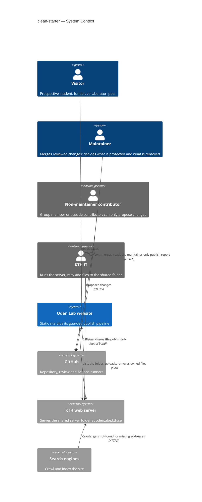
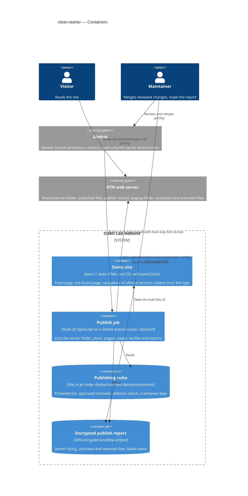
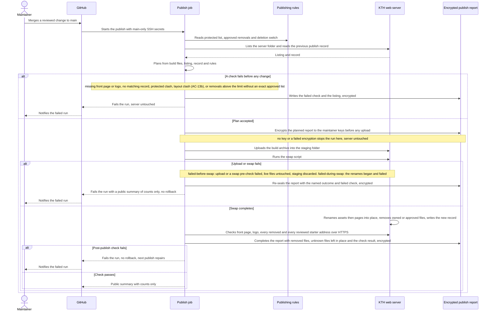
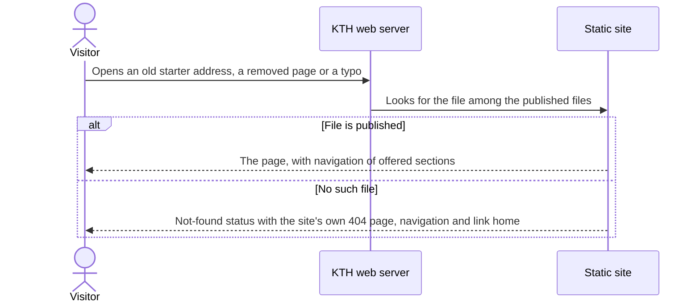
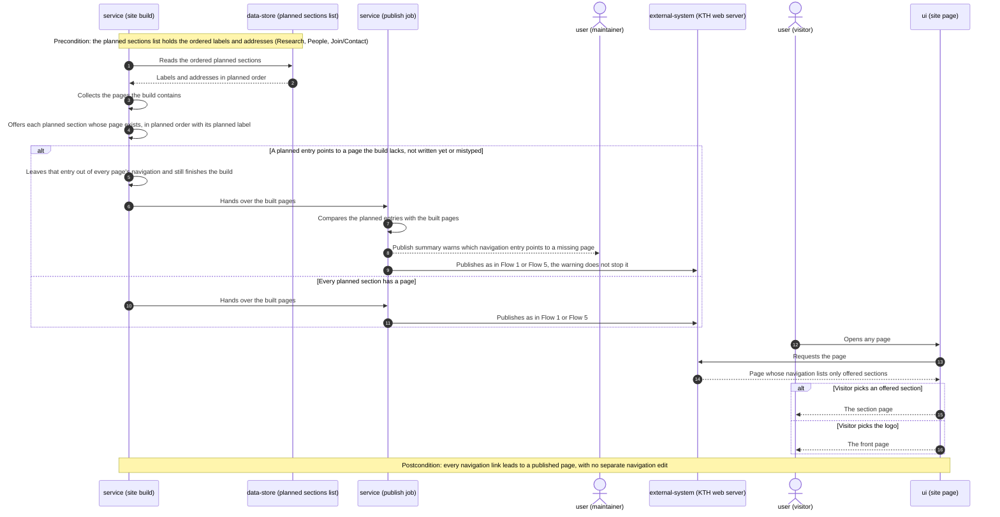
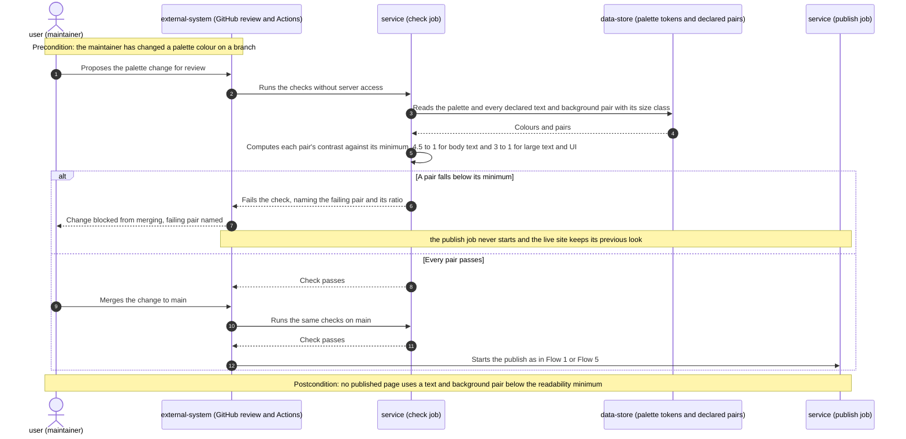
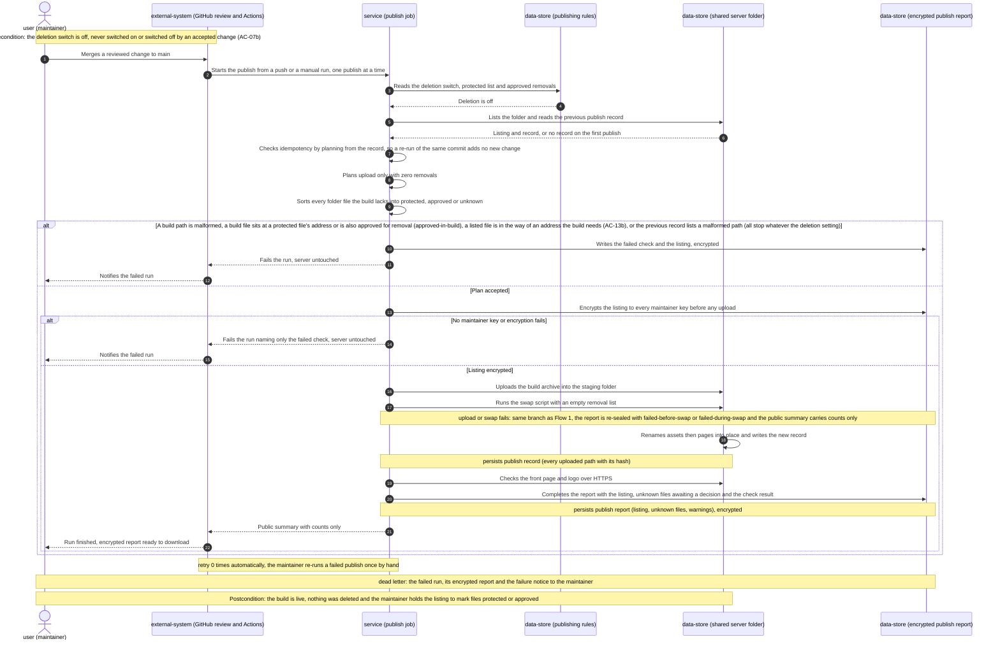
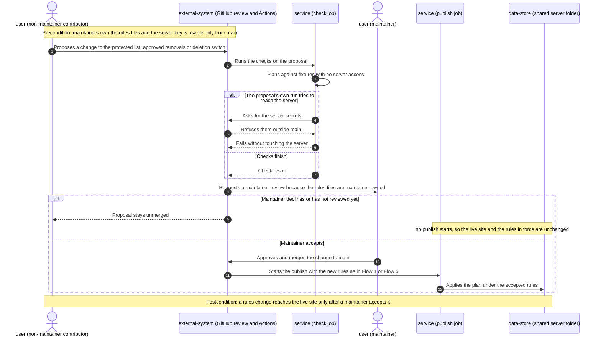
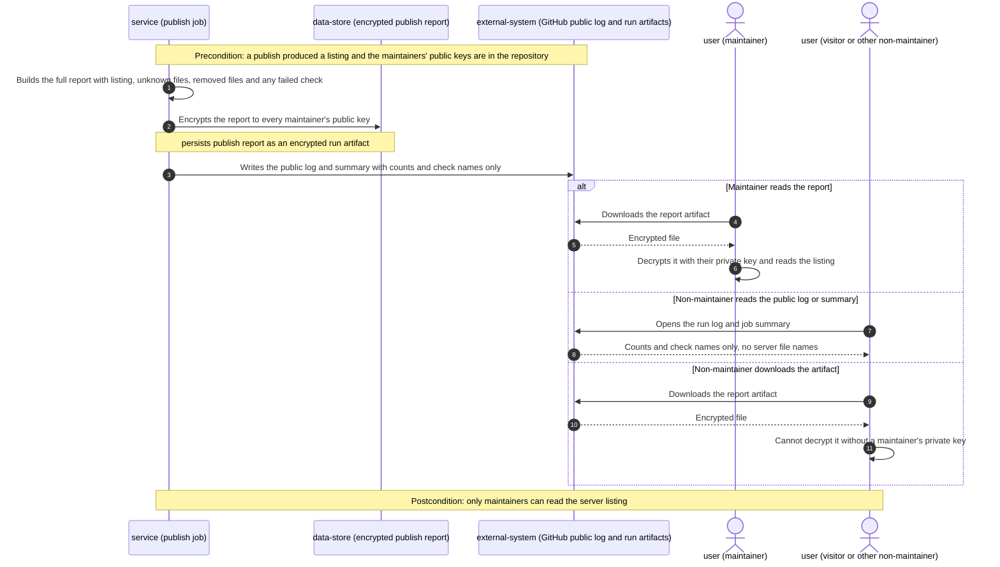
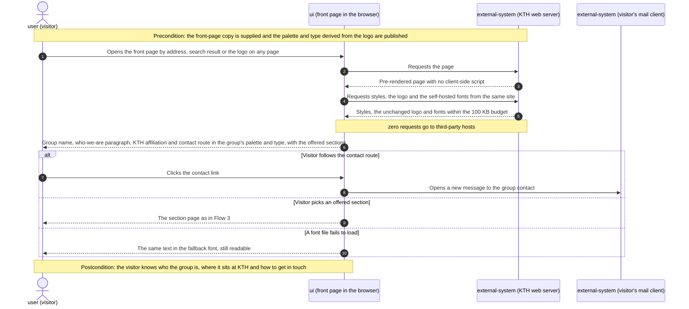

# Software Architecture Document — clean-starter

<!-- 12 Arc42 sections. Empty section → <!-- N/A: <one-line reason> -->. -->
<!-- C4 Context (L1) lives inline in §3. C4 Container (L2) lives inline in §5. -->
<!-- Numbers in §10 come VERBATIM from spec.md §6 NFR — no inventing, no rounding. -->

## 1. Introduction and goals

<!-- 🎯 Why: durable memory of «what + the three dominant qualities + who cares». A year from
     now nobody recalls which three qualities were critical for this system.
     📋 Write: 1 ¶ intent + 3 lines of top-3 quality goals + a stakeholders table.
     ¶4 is the override slot — critic `Override` resolutions emit «Decision override: <headline>
     — rationale: <reason>» bullets here so downstream skills see the deliberate choice. -->

**Intent.** Replace the starter that oden.abe.kth.se still serves with a minimal, honest front
page in the group's own identity, and turn publishing into a safe mirror. The live site reflects
what the maintainer publishes, a publish removes only files the site itself published or the
maintainer approved, and it stops before deleting anything when the build or the target folder
looks wrong. The feature serves visitors (prospective students, funders, peers), who must see only
real content, readable and with no dead ends. It also serves the maintainer, who must be able to
publish in minutes without manual server work and without endangering files others rely on in
the shared university server folder. It covers roadmap step 1, the starter-cleanup half of step 8
and a minimal slice of step 2 (spec §1).

**Top quality goals (1-liners; full scenarios in §10):**

1. **Safety of the shared server folder.** A publish never changes a protected file, never deletes
   a file it does not own or that was not approved, and stops before deleting when the build or
   folder looks wrong. Routine removal limit: "≤ 20 files removed per publish without a
   maintainer-approved list" (spec §6).
2. **An accurate mirror.** What is live equals what was last published. 100% of the reviewed
   starter addresses show the not-found page, and no navigation entry leads nowhere.
3. **Readable and self-contained pages.** Text meets ≥ 4.5:1 (body) / ≥ 3:1 (large text, UI)
   contrast, pages make 0 third-party requests, and fonts weigh ≤ 100 KB per page.
4. **A fast, consistent publish.** Merge to live takes ≤ 10 min, and visitors can receive a mix
   of old and new files for ≤ 5 s.

**Stakeholders.**

| Role | Interest | Sign-off owner? |
|---|---|---|
| visitor | Sees only real group content, readable, with no dead ends (US-01–US-04, US-08) | No |
| maintainer | Publishes in minutes; reviews the server listing; decides what is protected and what is removed (US-05–US-07) | Yes — accepts the before/after identity screenshot and every removal approval |
| Non-maintainer contributor (group member or outside contributor) | May propose changes; must never change the live site or the publishing rules unreviewed (AC-08) | No |
| KTH IT | Runs the server and may place files in the shared folder; those files must survive (AC-13) | No |
| Tech Lead | SAD approval | Yes |
| Security Lead | Required security review — first time a publish deletes files on a shared university server (spec §6.1) | Yes |

<!-- Decision overrides (¶4) — populated by the critic resolution loop, empty otherwise. -->

## 2. Constraints

<!-- 🎯 Why: §4 strategy only works when §2 has fixed WHAT IS ALREADY FIXED — stack, versions,
     deadline, regulatory. This is an input, not an output.
     📋 Write: four blocks — Technical / Organisational / Conventions / Regulatory.
     📌 Pin versions («<datastore> 18», not «<datastore>»); «Q3 deadline — hard», not «ideally».
     Never N/A — every feature inherits at least Conventions + Technical. -->

**Technical.**
- TypeScript on Node ≥ 24 (`package.json` `engines`, version pinned in `.nvmrc`); npm with a
  committed lockfile, `npm ci` in CI.
- Astro 7 (`astro ^7.3.5`), `output: "static"`, with no UI-framework islands (repo ADR
  [0001](../../adr/0001-build-the-site-with-astro-as-a-static-site.md)). Vitest 5, `@astrojs/check`
  and Prettier 3 with `prettier-plugin-astro`.
- No database. Content is typed files in git (repo ADR
  [0002](../../adr/0002-keep-content-as-typed-files-in-git.md)). The only state outside git is the
  shared server folder on the KTH web server.
- CI/CD runs on GitHub Actions, `ubuntu-latest`. One workflow (`.github/workflows/publish.yaml`)
  checks every PR and deploys `main`. Deploy authenticates over SSH with four existing secrets
  (`SSH_HOST`, `SSH_USERNAME`, `SSH_PRIVATE_KEY`, `SSH_TARGET_DIR`).
- The KTH web server only serves static files: no server-side code and no Node at request time.
  It serves the site's own `404.html` for every missing address within `oden.abe.kth.se`
  (confirmed during clarify). SSH shell access with `tar` is inferred from today's
  `appleboy/scp-action`, which unpacks a tarball remotely. `find` and `mv` are assumed, not
  verified (§11).
- Styling uses plain CSS custom properties from `src/styles/tokens.css` only, with no raw colours
  outside it (repo ADR [0003](../../adr/0003-style-with-plain-css-custom-properties.md)).

**Organisational.**
- One maintainer (pasichnyi). The architecture has to stay operable by one person.
- No external deadline. The trigger is that the next merge to `main` publishes the skeleton
  (spec §1).
- No effort budget is quoted (sized M). Every new dependency needs a reason (`CLAUDE.md`).

**Conventions.**
- [`CLAUDE.md`](../../../CLAUDE.md) and [`docs/architecture-map.md`](../../architecture-map.md)
  §Conventions.
- "Bad content fails the build, never the visitor": errors surface at build or publish time,
  never at request time.
- IDs are file names. Cross-entity logic is a pure function in `src/lib/` with a Vitest test.
- The design canon is [`docs/design-system.md`](../../design-system.md). Tokens in
  `tokens.css` lead and Figma mirrors them.

**Regulatory / external.**
- KTH requires its websites to follow its accessibility, GDPR and online-publication guidelines
  ("Create a website at KTH", intra.kth.se). Accessibility here means WCAG 2.1 AA contrast
  (spec §6).
- No visitor data is collected. Fonts and assets are self-served, so visitors' addresses are not
  sent to third parties (spec §6.1).
- Whether the site may carry its own palette and type under the KTH graphic profile is open
  (spec §8, owner pasichnyi, due 2026-10-18). The design keeps that a token-file edit (§11).
- Security review is required: this is the first time a publish deletes files on a shared
  university server (spec §6.1).

## 3. Context and scope

<!-- 🎯 Why: draws the SYSTEM BOUNDARY — who talks to it from outside, where the trust zone ends.
     Without §3, §5 and §8 (authorization) blur — unclear what's «inside» vs «outside».
     📋 Write: 2–3 sentences of business context + an external-systems table + a C4Context block.
     📌 «External: none (deliberate, no third-party in v1)» is itself a decision worth stating.
     Trust boundary — the line past which you don't trust data without checking it.
     Never N/A — greenfield still draws the planned actors + external systems. -->

The Oden Lab website is the public face of a KTH research group. Visitors read it, and one
maintainer publishes it by merging reviewed changes. The site is built and published from a public
GitHub repository into a **shared** folder on a KTH web server, and other parties (KTH IT,
certificate renewal, domain verification) may also write files there. The system boundary
therefore matters at the server folder. Inside it, only files the site's own publish recorded,
or the maintainer approved, are ours to change. Everything else is outside our trust zone and is
left alone and reported.

<!-- brownfield: Astro 7 static-site skeleton (dec77e0) — Base layout, Header with a static 3-item nav, Footer, tokens.css seeded from the logo + inherited blue/cyan scales, content collections with build-time integrity check, Vitest build smoke test; deploy = appleboy/scp-action copying dist/ over SSH (upload-only, never deletes). Starter files already removed from the repo by scaffold; architecture-map.md predates the skeleton (reflects 750bae1) but matches it. -->

**External systems (in / out):**

| Actor or system | Type | Interaction |
|---|---|---|
| visitor | Person | Reads pages over HTTPS; follows old or mistyped addresses; leaves via the contact route |
| maintainer | Person | Merges reviewed changes, which publishes them; reads the maintainer-only publish report and server listing; marks protected files and approves removals as reviewed changes |
| Non-maintainer contributor (group member or outside contributor) | Person (external) | Proposes changes, including to the publishing rules; nothing takes effect until a maintainer accepts it (AC-08) |
| GitHub (repository, review, Actions) | System (external) | Holds the source, content and publishing rules; enforces review before `main`; runs checks and the publish job; stores the run's report |
| KTH web server — shared server folder | System (external) | Serves the published files and the site's own not-found page; receives uploads, renames and deletions over SSH |
| KTH IT | Person (external) | Runs the server; may place files in the shared folder that the site never published (AC-13) |
| Search engines | System (external) | Crawl the site; must be told "not found" for addresses the site does not have (AC-02) |
| Visitor's mail client | System (external) | Receives the front page's contact link; there is no contact form (ux-flows) |

**External:** no third-party asset hosts. Fonts, styles and scripts are all served from the site
itself (0 third-party requests per page, spec §6). This is a deliberate decision, not an omission.

**C4 Context (L1):** <!-- syntax → references/c4-mermaid-syntax.md. Real names, no <placeholder> stubs. -->



## 4. Solution strategy

<!-- 🎯 Why: the 3–4 STRATEGIC PILLARS every ADR grows from. Without §4 each ADR looks random —
     there's no umbrella. ⭐ The densest section — the blast-radius gate fires almost always here
     (decisions are irreversible + multi-module).
     📋 Write: 3–4 choices; each a heading + 2–3 sentences of rationale.
     📌 «Store content as a table of typed blocks» is a pillar — ADR-0001 grows from it. -->

**Top strategic choices (the seeds for ADRs):**

1. **Target surfaces: a static web frontend and a publish worker**
   (`target_surfaces: [web-frontend, worker]`, [ADR-0001](adr/0001-build-a-static-web-frontend-and-a-separate-publish-worker.md)).
   The visitor-facing site (front page, not-found page, navigation, identity) is one surface. The
   guarded publish is a second one: an event-started job (a merge to `main`) with no visitors,
   whose output is a publish report. Splitting them gives the deletion guards (AC-11 to AC-13)
   their own domain and infra layers and their own unit and integration tests, which serves
   quality goal 1. It also keeps site code free of server concerns.
   - *UI architecture (web-frontend), inline:* static pre-rendered HTML with zero client-side
     JS, inherited from repo ADR
     [0001](../../adr/0001-build-the-site-with-astro-as-a-static-site.md). The not-found page is
     a static `404.html` that the KTH server already serves for missing addresses. Every
     alternative (SSR, SPA) is ruled out by that ADR and by a server that runs no code, so there
     is no new ADR here.
2. **Plan, then apply: a pure planner and a thin SSH executor**
   ([ADR-0002](adr/0002-plan-each-publish-with-a-pure-planner-and-a-thin-ssh-executor.md)).
   `planPublish()` is a pure function. It takes the build's file list, the server listing, the
   previous publish record, the protected list, the approvals and the deletion switch, and returns
   either a plan (upload, remove, report) or the first failed check. It never touches the network,
   so every guard is unit-tested. The executor only applies an accepted plan, using OpenSSH tools
   already on the runner, with no new npm package and no third-party deploy action. Ownership is
   decided by a **publish record** (`.publish-record.json` in the target folder, written last by
   every publish). Only files it lists, or files on the approved list, may be removed. Anything
   else is unknown, left in place and reported. The deletion switch starts **off**, and the
   first publish writes the first record. This serves quality goals 1 and 2.
3. **Stage, then rename into place**
   ([ADR-0003](adr/0003-stage-the-build-on-the-server-then-rename-it-into-place.md)). The build
   is uploaded as one archive into a hidden staging folder inside the target folder and unpacked
   there. One remote script then renames files into place (content-hashed assets, then pages),
   then applies removals, then writes the new record. The slow network upload touches nothing
   served. The swap is local renames, well under the ≤ 5 s mixed-version target, and protected
   files are never moved or copied. A failed post-publish check fails the run without automatic
   rollback, and the next publish repairs from the record. This serves quality goal 4 and answers
   the spec §8 question on a single-step switch.
4. **The private report is a GPG-encrypted artifact**
   ([ADR-0004](adr/0004-deliver-the-publish-report-as-a-gpg-encrypted-artifact.md)). The public
   log and job summary carry only counts and failed-check names. The full report (server listing,
   unknown files, removed files) is encrypted on the runner to each maintainer's public key in
   the repo and attached to the run. The repo, its logs and its artifacts are public, so
   encryption is what makes the report maintainer-only (AC-09). No new service or secret is
   needed.
5. **Publishing rules are reviewed files, and the server key is usable only from `main`**
   ([ADR-0005](adr/0005-gate-publishing-rules-by-review-and-main-only-server-secrets.md)). The
   protected list, the approved removals and the deletion switch are files under `deploy/rules/`
   that reach `main` only through a reviewed pull request (CODEOWNERS = maintainers, over every
   file the deploy step loads while the server key is in its environment). The SSH
   secrets live in a GitHub environment that only `main` may use, so no pull-request run can
   reach the server (AC-08, spec §6.1).

Each tactical decision in later sections should trace to one of these seeds. Tactical decisions that *contradict* a strategic choice are red flags — surface them in §11.

## 5. Building block view

<!-- 🎯 Why: INTERNAL DECOMPOSITION — modules, containers, datastores. The static topology: who
     may talk to whom. Without §5, §6 (the flows) has no vocabulary of participants.
     📋 Write: 1 ¶ on the style (layered / hexagonal / clean / event-driven) + a folder tree + a
     C4Container block.
     📌 Draw ONE Container per declared `target_surface` (frontmatter): a fullstack
     [backend-service, web-frontend] = a backend-API container + a web/SPA container; a
     [backend-service, mobile-app] = the API + the mobile app. The Container(web, …) line below is
     just one surface's container — swap/add per what was declared in §4. → _shared/surfaces.md
     📌 e.g. «web app, content API, media worker, datastore, object store, CDN». -->

There are two surfaces with two styles, both following the repo's conventions. The **static
site** keeps Astro's standard folders (`CLAUDE.md`): pages are routes, `Base.astro` is the one
layout, cross-entity logic is a pure function in `src/lib/` with a test, and styling is tokens
only. The **publish worker** is a small **functional-core / imperative-shell** module in a new
top-level `deploy/` folder. The core (`plan.ts`) is a pure function holding every rule. The shell
(`publish.ts`, `ssh.ts`, `report.ts`, `remote/swap.sh`) only does I/O and applies an accepted
plan (ADR-0002). `deploy/` sits beside `src/`, not inside it, because it is not site code and
must never be bundled or shipped to visitors. Both share `tests/` and the one `npm test` and
`npm run lint` gate.

**Internal decomposition:**

```
src/                                   # web-frontend surface
├── data/sections.ts                   # ordered planned sections {label, href} — Research, People, Join/Contact
├── lib/navigation.ts                  # offeredSections(planned, builtRoutes) — pure (AC-03)
├── lib/contrast.ts                    # WCAG contrast ratio + pair check — pure (AC-06)
├── styles/tokens.css                  # palette + type derived from the logo (identity, D5)
├── styles/contrast-pairs.ts           # declared text/background pairs + size class, next to the palette
├── styles/global.css                  # @font-face for the self-hosted fonts
├── components/Header.astro            # renders offeredSections(); logo links home
├── pages/index.astro                  # front page — name, who-we-are, KTH affiliation, contact (AC-15)
└── pages/404.astro                    # not-found page — Base layout, nav, link home, noindex (AC-02)
public/
├── logo.svg, icon.png                 # unchanged logo (non-goal: no redraw)
└── fonts/*.woff2                      # vendored, Latin subset, open licence (≤ 100 KB per page)
deploy/                                # worker surface
├── plan.ts                            # planPublish() — pure core: ownership, every guard (AC-07, AC-11–AC-13)
├── publish.ts                         # shell entry: list → plan → report → stage → swap → verify
├── ssh.ts                             # thin wrapper over the runner's ssh/scp
├── report.ts                          # public summary (counts) + GPG-encrypted full report (AC-09)
├── remote/swap.sh                     # POSIX sh run on the server: rename into place, remove, write record
├── rules/protected.txt                # protected files, one path per line
├── rules/approved-removals.txt        # maintainer-approved removals, one path per line
├── rules/settings.json                # { "deletion": "off", "removalLimit": 20 }
└── maintainers/*.asc                  # maintainers' public GPG keys
tests/
├── navigation.test.ts, contrast.test.ts          # unit
├── plan.test.ts                                  # unit — one case per guard and per AC-07/AC-11–AC-13 branch
├── swap.test.ts                                  # integration — runs swap.sh against a temp folder
└── build.test.ts                                 # smoke + 404 present + 0 off-site refs + font budget
.github/
├── workflows/publish.yaml             # check job (all PRs + main); deploy job (main, environment kth-server)
└── CODEOWNERS                         # maintainers own every file the deploy step loads with the key set (ADR-0005)
```

**C4 Container (L2):** <!-- syntax → references/c4-mermaid-syntax.md. Real names, no <placeholder> stubs. ONE Container per declared target_surface (frontmatter); the web container below is one example surface. -->



## 6. Runtime view

<!-- 🎯 Why: the RUNTIME FLOW of 1–2 critical scenarios — who talks to whom, when, in what order.
     Without §6, §5 is just boxes with no life.
     📋 Write: a Mermaid sequenceDiagram. Participants are names from §5 (don't invent new ones).
     Messages are semantic («saves a draft»), NO HTTP verbs / paths / status codes — endpoint-level
     sequences arrive at the `api` stage.
     📌 e.g. «author → web: composes draft → web → content API: save». Seed the primary flow(s) here;
     the `sequences` stage then covers every §5 AC (no cap). Never N/A for M+; XS/S keeps ≥1 happy-path flow. -->

Two seed flows. `/sdd:sequences` covers every remaining §5 AC: the deletion-off listing (AC-07,
AC-07b), the readability block (AC-06), the missing-navigation-page warning (AC-04) and the
non-maintainer proposal (AC-08).

**Critical flow 1: a publish with deletion on (AC-01, AC-10–AC-13)**



**Critical flow 2: a visitor opens an address the site does not have (AC-02, AC-10)**



### Flow 3: navigation built from the planned sections (AC-03, AC-04)



### Flow 4: a palette change blocked by the readability check (AC-06)



### Flow 5: a publish with deletion off (AC-07, AC-07b, AC-13)

The publish is started by an event (a merge or a manual run), so it carries the async shape.
Idempotency comes from planning against the publish record, not against history. There is no
automatic retry, and the failed run with its encrypted report is the dead letter.



### Flow 6: a non-maintainer proposes a change to the publishing rules (AC-08)



### Flow 7: who can read the publish report (AC-09)



### Flow 8: a visitor opens the front page (AC-05, AC-15)

> **Pending T5/T6.** The front-page copy, palette, type and self-hosted fonts are not built yet
> (spec §8, due 2026-10-18). This flow is the target, not the current behaviour.



### Coverage: user stories and acceptance criteria

| User story | Flow(s) |
|---|---|
| US-01 See only real group content | Flow 1, Flow 2 |
| US-02 Land safely on a missing page | Flow 2 |
| US-03 Navigate only to real sections | Flow 3 |
| US-04 Recognise the group's identity | Flow 4, Flow 8 |
| US-05 Review the server before deletion | Flow 5, Flow 6, Flow 7 |
| US-06 Publish mirrors the repository | Flow 1 |
| US-07 Repository free of starter notices | N/A: repository content with no runtime behaviour (AC-14) |
| US-08 Learn the basics from the front page | Flow 8 |

| AC | Shown by |
|---|---|
| AC-01 | Flow 1, "Plan accepted" branch: removals applied, removed files in the report |
| AC-02 | Flow 2, "No such file" branch |
| AC-03 | Flow 3, offered sections in planned order |
| AC-04 | Flow 3, "planned entry points to a page the build lacks" branch |
| AC-05 | (pending T6) Flow 8, page in the group's palette and type with the unchanged logo. The one-time before/after screenshot sign-off is a manual acceptance, not a runtime step |
| AC-06 | Flow 4, "A pair falls below its minimum" branch |
| AC-07 | Flow 5, happy path |
| AC-07b | Flow 5, precondition (deletion switched off by an accepted change) |
| AC-08 | Flow 6, all three branches |
| AC-09 | Flow 7, all three branches |
| AC-10 | Flow 1 (removal) and Flow 2 (the removed address is not found) |
| AC-11 | Flow 1, swap step that removes only owned or approved files |
| AC-11b | Flow 1 "A check fails before any change" branch, and Flow 5 protected-address branch |
| AC-12 | Flow 1, "A check fails before any change" branch |
| AC-13 | Flow 1 report completion and Flow 5 listing sort (unknown files left in place and reported) |
| AC-13b | Flow 1 "A check fails before any change" branch (layout clash), and Flow 5 first branch |
| AC-14 | N/A: a property of the repository's files, checked at review, not a runtime flow |
| AC-15 | (pending T5) Flow 8, front-page content |

**Flags for design (not decided here):**
- *Participant not a §5 container:* Flows 3, 4 and 6 use the **check job** (site build plus
  tests on every pull request and on `main`). It appears in §7 and §8 but not as a container in
  the §5 C4 view. Consider adding it there, or note that it is part of the static site's build.
- *Retry shape (ADR-worthy, flag only):* a failed publish is never retried automatically. The
  maintainer re-runs it by hand, and the next publish repairs from the record. This follows from
  ADR-0003 (no automatic rollback) but is not stated as a decision. Consider adding one line to
  ADR-0003 via `/sdd:decide-adr`.
- *Idempotency source:* re-runs are safe because every plan starts from the publish record and
  the live listing. The record does not carry the source commit. Add it only if a later need
  to tell "same commit re-run" apart from "new commit" appears.
- *Persisted entities for data-model:* the **publish record** (every uploaded path with its
  hash, written last by every publish) and the **publish report** (encrypted run artifact). Both
  are files. There is no database, table or index.

## 7. Deployment view

<!-- 🎯 Why: the TOPOLOGY DevOps must know without reading the deploy charts — how many replicas,
     where the background worker lives, AT WHAT NUMBERS we scale.
     📋 Write: 2–3 sentences on topology + monitoring + concrete threshold numbers.
     📌 e.g. «500 authors → partition by quarter» (not «we'll think about scale later»).
     🎯 N/A allowed for XS/S that reuses an existing deployment unit with no change.
     Deployment-diagram scaffold → templates/deployment.md. -->

Nothing runs at request time. The KTH web server serves static files from one shared folder.
All logic runs on GitHub-hosted `ubuntu-latest` runners in `.github/workflows/publish.yaml`. A
**check** job (every pull request and every push to `main`) runs lint, tests (including the
readability, third-party and font-budget checks) and the build. A **deploy** job (`main` only,
via a push or a manual run; `needs: check`; environment `kth-server`; the existing `deploy-kth`
concurrency group with no cancellation, so two publishes never overlap) runs
`node deploy/publish.ts`. It replaces `appleboy/scp-action`. **The workflow-level concurrency rule
must change too.** Today it sets `cancel-in-progress: true` for every ref, so a second merge
cancels a running publish, possibly mid-swap. It becomes
`cancel-in-progress: ${{ github.event_name == 'pull_request' }}`, which still cancels superseded
pull-request checks but never a publish. There is one instance of everything, no replicas and no
scaling knobs.

**Server-folder layout after this feature** (`SSH_TARGET_DIR`):

```
<SSH_TARGET_DIR>/
├── index.html, 404.html, _astro/…, logo.svg, icon.png, fonts/…   # owned — listed in the record
├── .publish-record.json        # owned — written last by every publish (ADR-0002)
├── .publish-staging/           # transient — wiped at the start of each publish (ADR-0003)
├── <protected files>           # named in deploy/rules/protected.txt — never changed
└── <unknown files>             # e.g. KTH IT's — left in place, reported every publish
```

**Rollout order** (deletion stays off until the last step):
1. Repository settings: protect `main`, add `CODEOWNERS`, move the SSH secrets into the
   `kth-server` environment restricted to `main`, and add the maintainer's public key (ADR-0005,
   ADR-0004).
2. Probe publish with deletion off. It confirms `find`/`tar`/`mv` exist on the server, writes the
   first record and delivers the first listing (AC-07).
3. The maintainer marks protected files and approves the starter files in one reviewed change.
4. A reviewed change sets `deletion: "on"`. The next publish is the first starter cleanup (AC-01).
   It needs the exact approved list, since it exceeds the 20-file routine limit.

**Monitoring:**
- *Run duration* (merge to publish complete) is read from the deploy run's timestamps. It is the
  merge-to-live KPI, with a target of ≤ 10 min.
- *Swap duration* is logged by `swap.sh` from the first rename to the record write. It is the
  mixed-version window, with a target of ≤ 5 s.
- *Post-publish check* fetches the front page and logo (must load), plus every removed address and
  the reviewed starter addresses (must be not-found). A failure fails the run.
- *Alerts:* a failed run triggers GitHub's own failure notification to whoever merged. There is no
  other alerting channel (ADR-0004).
- *Job summary* shows counts only: uploaded, removed, unknown, warnings and the failed check.

**Scaling thresholds:**
- Comfortable while the build stays under roughly 2,000 files or 200 MB, since the rename step is
  linear in file count. Re-measure the swap duration once the publications list (roadmap step 7)
  lands.
- Staging briefly doubles the site's disk use on the server. The quota of the shared folder is
  unknown (§11).

## 8. Crosscutting concepts

<!-- 🎯 Why: CROSS-CUTTING PATTERNS spanning several modules: logging, errors, authorization, ID
     strategy, events, caching. ⭐ The second-densest section. A pattern inside one module is NOT
     here; a project-wide convention belongs in the convention file.
     📋 Write: a table — concept / convention / where defined. One row per concept.
     📌 e.g. «sortable time-based IDs generated in the app layer» as a default from the convention file. -->

| Concept | Convention | Where defined |
|---|---|---|
| Error handling | Fail the build or stop the publish, never the visitor. Schema errors, dangling references, a failed readability pair or an off-site asset fail the **check** job, so the deploy job never runs. A failed publish guard stops the run before it changes the server. The only visitor-facing error is the static `404.html`. | `CLAUDE.md`; here; ADR-0002 |
| Logging and disclosure | The public Actions log and job summary carry counts, check names and names that are already public (build paths, protected-list entries, navigation entries). Any name of a server file the site did not publish goes **only** into the encrypted report. If encryption fails, the publish stops before uploading. | ADR-0004 |
| Authorization | Only a reviewed merge to `main` publishes. CODEOWNERS (maintainers) covers every file the deploy step loads while `SSH_PRIVATE_KEY` is in its environment: `deploy/`, `.github/` and the site files `deploy/publish.ts` imports (`src/data/sections.ts`, `src/lib/navigation.ts`). `tests/workflow.test.ts` walks the imports and fails when a loaded file has no code owner, so a new import must add its file to CODEOWNERS. The SSH secrets are usable only from `main` (environment `kth-server`). Pull-request checks run the planner on fixtures, with no server access. | ADR-0005 |
| ID strategy | Content IDs stay file names (repo convention). Server files are identified by their path relative to the target folder, normalised: no leading `/`, no `..`, no control or newline characters. The planner stops only when a path it would act on (a build, owned, approved or protected path) breaks this. A malformed name on an **unknown** file is reported in the encrypted report and never touched, so it never blocks a publish (spec §6.1, AC-13). The one exception is a file in the way of an address the build needs: the publish stops with `layout-clash` and leaves it untouched (AC-13b). | `CLAUDE.md`; ADR-0002 |
| Remote command safety | `swap.sh` reads its rename and removal lists as NUL-separated input and never builds a shell command from a file name. The executor never interpolates server-side names into commands. | here |
| Ownership | A server file is owned (in the publish record), approved (in `approved-removals.txt`), protected (in `protected.txt`) or unknown. Only owned or approved files missing from the build are removed. Protected and unknown files are never changed. | ADR-0002 |
| Styling and identity | Tokens only. The palette and type derived from the unchanged logo live in `src/styles/tokens.css`. The text/background pairs the site uses are declared next to it in `contrast-pairs.ts`, and a test enforces ≥ 4.5:1 / ≥ 3:1. Restyling means editing tokens. | `CLAUDE.md`; repo ADR 0003 |
| Fonts and assets | Everything is self-served: vendored WOFF2 fonts in `public/fonts/` (Latin subset, open licence, `font-display: swap`). A build test fails on any off-site `src`, `href` or CSS `url()`. | here |
| Navigation | The ordered planned sections live in `src/data/sections.ts`. The header offers the ones whose page exists in `src/pages`, via `offeredSections()`. The publish summary warns about any planned entry whose page is missing from `dist/` (AC-04). | here |
| Internationalisation | N/A. English only (idea-brief §5). | `CLAUDE.md` |
| Observability | No runtime telemetry and no visitor data. Publish-time signals: run duration, swap duration, post-publish check and job-summary counts (§7). | §7 |
| Events | Two triggers publish, both only on `main`: a push (a merge) and a manual run (`workflow_dispatch`). Each starts check, then deploy, serialised by the `deploy-kth` concurrency group and never cancelled (§7). Pull requests run check only. Nothing else is event-driven. | `.github/workflows/publish.yaml` |

## 9. Architecture decisions

<!-- 🎯 Why: the REVERSE INDEX onto the adr/ folder. `ls adr/` gives the files; §9 gives the
     semantics — why they exist, which SAD section they attach to, what status.
     📋 Write: a 4-column table, one row per ADR. Mixed status is fine.
     📌 e.g. «0001 | Store content as a table of typed blocks | Accepted | §4». -->

| # | Title | Status | Section |
|---|---|---|---|
| [0001](adr/0001-build-a-static-web-frontend-and-a-separate-publish-worker.md) | Build a static web frontend and a separate publish worker | Accepted | §4 |
| [0002](adr/0002-plan-each-publish-with-a-pure-planner-and-a-thin-ssh-executor.md) | Plan each publish with a pure planner and a thin SSH executor | Accepted | §4 |
| [0003](adr/0003-stage-the-build-on-the-server-then-rename-it-into-place.md) | Stage the build on the server, then rename it into place | Accepted | §4 |
| [0004](adr/0004-deliver-the-publish-report-as-a-gpg-encrypted-artifact.md) | Deliver the publish report as a GPG-encrypted artifact | Accepted | §4 |
| [0005](adr/0005-gate-publishing-rules-by-review-and-main-only-server-secrets.md) | Gate publishing rules by review and main-only server secrets | Accepted | §4 |

ADR files live under `docs/features/clean-starter/adr/NNNN-<title>.md`. The repo-wide ADRs
(`docs/adr/0001`–`0003`: static Astro, typed files in git, plain-CSS tokens) are inherited
constraints (§2), not part of this table.

## 10. Quality requirements

<!-- 🎯 Why: the QUALITY TREE — take a goal from §1 and break it into concrete leaves: tests,
     metrics, configs, drills. ⭐ Without §10, §1 is a manifesto. With §10 each declaration maps
     to something PROVABLE.
     📋 Write: per §1 goal — When / Then / How-verify. Numbers from spec §6 NFR VERBATIM (don't
     round ≤250ms to ≤300ms — that's a critic F6 hit).
     📌 e.g. «p95 ≤ 500 ms on a block update, verified by a 100 req/s load test». -->

Each §1 quality goal expanded into a full scenario (numbers quoted verbatim from spec §6):

**QG-1. Safety of the shared server folder**
- **When:** a publish runs with deletion on and the folder holds protected files and unknown files
  (e.g. KTH IT's), or the target folder lacks the previous record, or the build lacks the front
  page or logo, or the plan removes more files than the routine limit.
- **Then:** protected files are unchanged (AC-11); a build file at a protected address stops the
  publish before any change (AC-11b); unknown files stay and are reported (AC-13); and the
  publish stops before deleting when any AC-12 check fails. Routine removal limit: "≤ 20 files
  removed per publish without a maintainer-approved list" (spec §6), and an approval of a list
  that differs by even one file does not count.
- **How verify:** `tests/plan.test.ts` has one case per guard and per branch: empty folder, wrong
  folder, missing record, record without front page or logo, 20 versus 21 removals, an approved
  list off by one file, a protected clash, unknown files including odd names.
  `tests/swap.test.ts` runs `swap.sh` against a temp folder seeded with protected and unknown
  files, then asserts their bytes and timestamps are unchanged. Live: rollout step 2 (probe with
  deletion off) runs before any deletion.

**QG-2. An accurate mirror**
- **When:** the first starter cleanup or a later page removal has been published (AC-01, AC-10),
  or a visitor opens any page.
- **Then:** "100% of the reviewed starter addresses show the not-found page and signal not-found"
  (spec §6). Removed pages show the not-found page (AC-10). The navigation offers exactly the
  planned sections whose page is published, in planned order (AC-03), and the dead-navigation-link
  KPI target is 0 (spec §7).
- **How verify:** the post-publish check requests every reviewed starter address and every removed
  address, expects a not-found status, and fails the run otherwise. `tests/navigation.test.ts`
  covers `offeredSections()` for all-present, none-present and a mistyped href.
  `tests/build.test.ts` asserts that `dist/404.html` exists with `noindex`, and that every header
  link resolves to a file in `dist/`.

**QG-3. Readable and self-contained pages**
- **When:** a maintainer changes a palette colour or the fonts and opens a pull request or merges.
- **Then:** every declared text/background pairing meets "≥ 4.5:1 contrast for body text; ≥ 3:1
  for large text and UI elements (WCAG 2.1 AA)", otherwise publishing is blocked and the failing
  pair is named (AC-06). Third-party requests: "0 per page — fonts, styles and scripts all served
  from the site itself". Font payload: "≤ 100 KB of font files per page" (spec §6).
- **How verify:** `tests/contrast.test.ts` resolves every pair in `contrast-pairs.ts` against
  `tokens.css` and fails with the pair's name (an "automated check, in the test suite, of every
  text/background pairing the site uses, as declared alongside the palette"). `tests/build.test.ts`
  scans every built HTML and CSS file for off-site `src`, `href` and `url()` references (a
  "build-time scan of built pages for off-site asset references") and sums the font files each page
  references (a "build output size check").

**QG-4. A fast, consistent publish**
- **When:** a reviewed change is merged to `main`, including when the publish is interrupted.
- **Then:** merge-to-live is "≤ 10 min". The mixed-version window is "≤ 5 s in which a visitor can
  receive a mix of old and new files; an interrupted publish leaves the previous version fully
  served" (spec §6). This holds for any interruption before the rename step. The narrower case is
  §11 accepted debt.
- **How verify:** merge-to-live is measured as "CI run duration from merge to publish complete" from
  the deploy run's timestamps. The swap window is logged by `swap.sh` (first rename to record
  written) together with the post-publish check of the front page and logo, matching spec §6's
  "publish log timestamps + post-publish check of front page and logo". `tests/swap.test.ts` kills
  the swap before the rename step and asserts that the temp folder still holds the previous
  version byte for byte.

## 11. Risks and technical debt

<!-- 🎯 Why: ⭐ collects EVERYTHING that can break — not only the technical. Without §11 risks get
     discussed at standups and lost; debt lives only in the head of whoever accepted it.
     📋 Write: a risk/debt table — severity — mitigation — owner. Accepted debt in its own block.
     📌 The first risk is often a product risk, not a technical one. That's normal. -->

<!-- Severity literals: Low / Medium / High for regular risks; "Open question" for rows created by
     a Save-as-OQ resolution during the Socratic walk (see references/socratic.md). -->

| Risk / debt | Severity | Mitigation | Owner |
|---|---|---|---|
| The KTH server's shell may lack `find` or `mv`. Only `tar` is evidenced, by today's `scp-action`; an SFTP-only account would break the executor and the swap (ADR-0002, ADR-0003). | Medium | Rollout step 2's probe publish (deletion off) checks `command -v find tar mv` before anything else and stops with a named failure. Fallback if missing: an SFTP-batch executor variant. Only the shell layer changes, not the planner. | pasichnyi |
| Others write to the shared folder (KTH IT, certificate renewal, verification files). Spec §8 asks who, with the default "nobody". | Medium | Unknown files are never deleted and are reported on every publish (AC-13). The first listing (rollout step 2) is the evidence. The spec question is due before deletion is switched on. | pasichnyi |
| Repository settings drift: branch protection, the `kth-server` environment's `main`-only rule or CODEOWNERS is relaxed, quietly reopening the path from an unmerged branch to the server key (ADR-0005). | Medium | The deploy job declares `environment: kth-server`, so missing secrets fail loudly. Re-check the three settings as part of every change that sets `deletion: "on"`. | pasichnyi |
| The maintainer loses their GPG private key, so the listing and reports become unreadable (ADR-0004). | Medium | Keep an offline backup of the key. A new key is a reviewed change to `deploy/maintainers/`. Deletion stays off while no maintainer can read the report. | pasichnyi |
| The shared folder's disk quota may not hold a second copy of the site during staging (ADR-0003). | Low | The probe publish reports free space. The site is small (§7 thresholds). A failed unpack stops before the rename step, so the old version stays served. | pasichnyi |
| A file someone else owns has an unusual name (newline, control character) that the listing parser cannot handle. | Low | The listing is NUL-separated. A malformed name on an **unknown** file is reported and never acted on. The planner stops only when a path it would act on (build, owned, approved or protected) is malformed (§8 ID strategy), so one stray file cannot block every publish. | pasichnyi |
| Guards too tight: more than the spec §7 target of "≤ 1 per month" false-alarm stops. | Low | Count stops in the maintainer's publish notes. Loosen through the approved-removals list (a reviewed rule-file edit, no code change). The 20-file routine limit is a spec §6 number: changing it is a spec change first, and `removalLimit` in `settings.json` must equal the spec value. | pasichnyi |
| KTH graphic profile may not allow the group's own palette and type (spec §8, due 2026-10-18). | Low | Styling is tokens only, so a forced change is a `tokens.css` edit, still gated by the contrast test (QG-3). | pasichnyi |
| Rights holder after the licence file is removed (spec §8, due 2026-10-31). | Low | Not architectural. The default "all rights reserved, held by the group" needs no code. | pasichnyi |
| Front-page copy not yet supplied (spec §8, due 2026-10-18). | Low | AC-15 cannot pass without it. `implement` treats the copy as an input, not something it invents. | pasichnyi |
| Stale architecture map: `docs/architecture-map.md` reflects 750bae1 (before the skeleton) and still lists the starter deletion as pending. | Low | Re-run `/sdd:survey` after this feature to map what exists, including `deploy/`. | pasichnyi |

**Accepted debt (acceptable in v1, plan to fix later):**
- An interruption inside the sub-second rename step can leave some pages new and some old. Every
  page still renders and the next publish repairs it, but this narrows spec §6's "an interrupted
  publish leaves the previous version fully served" (ADR-0003).
- There is no automatic rollback when the post-publish check fails. The run fails and the next
  publish repairs from the record (ADR-0003).
- There is no local dry run against the real server. The plan is visible only through a CI run
  (ADR-0001).
- `.publish-record.json` and the transient `.publish-staging/` are reachable over HTTPS. Both hold
  only the site's own public files and their names (ADR-0002, ADR-0003).
- Review is a discipline, not a lock, while there is one maintainer, because self-approval is
  allowed (spec §6.1, ADR-0005).

## 12. Glossary

<!-- 🎯 Why: ⭐ the DOMAIN GLOSSARY that ends arguments a year later («checkpoint — weekly or
     biweekly? quarter — calendar or fiscal?»).
     📋 Write: a term / meaning table. Business + technical terms mixed.
     📌 e.g. «Lesson | a unit inside a course made of blocks (text, video)». -->

| Term | Meaning |
|---|---|
| maintainer | Any person with rights to merge changes that publish to the live site. Not a group member and not KTH IT (root `CONTEXT.md`). |
| visitor | Anyone who reads the public site in a browser. Not a group member (root `CONTEXT.md`). |
| protected file | A file in the server folder that the site does not build but that must survive every publish. A maintainer names each one in `deploy/rules/protected.txt` (feature `CONTEXT.md`). |
| section | A top-level area of the site with its own page, offered in the main navigation from the ordered list of planned sections (feature `CONTEXT.md`). |
| starter | The template site from the first attempt: demo pages, generated files, template notices. Not the group's own logo, icon or colours (feature `CONTEXT.md`). |
| publish record ⚑ | `.publish-record.json` in the target folder. It lists every path the last publish uploaded, with its hash, and defines which server files the site owns (ADR-0002). |
| owned file ⚑ | A server file listed in the previous publish record. It may be removed when it is no longer in the build. |
| unknown file ⚑ | A server file that is neither owned, approved nor protected. It is never changed and is reported on every publish (AC-13). If it is in the way of an address the build needs, the publish stops instead (AC-13b). |
| approved removal ⚑ | A server file a maintainer listed in `deploy/rules/approved-removals.txt`. Above the routine removal limit, the list must equal the planned removals exactly (AC-12). |
| deletion switch ⚑ | `deletion` in `deploy/rules/settings.json`. Off means a publish uploads and lists only; on means it may remove owned or approved files. It starts off. |
| routine removal limit ⚑ | The most files a publish may remove without an exactly matching approved list: 20 (spec §6). |
| staging folder ⚑ | `.publish-staging/` inside the target folder, where the build is unpacked before being renamed into place (ADR-0003). |
| publish report ⚑ | The maintainer-only outcome of one publish (uploaded, removed, unknown, failed check, warnings), delivered GPG-encrypted (ADR-0004). The public job summary carries only its counts. |
| server listing ⚑ | The part of the publish report naming every server-folder file the build does not contain (AC-07). |
| offered section ⚑ | A planned section whose page exists in the build, and so appears in the navigation (AC-03). |

⚑ = a domain term surfaced during design and not yet in `CONTEXT.md`. Add it with
`/sdd:glossary clean-starter` before the terms drift.
