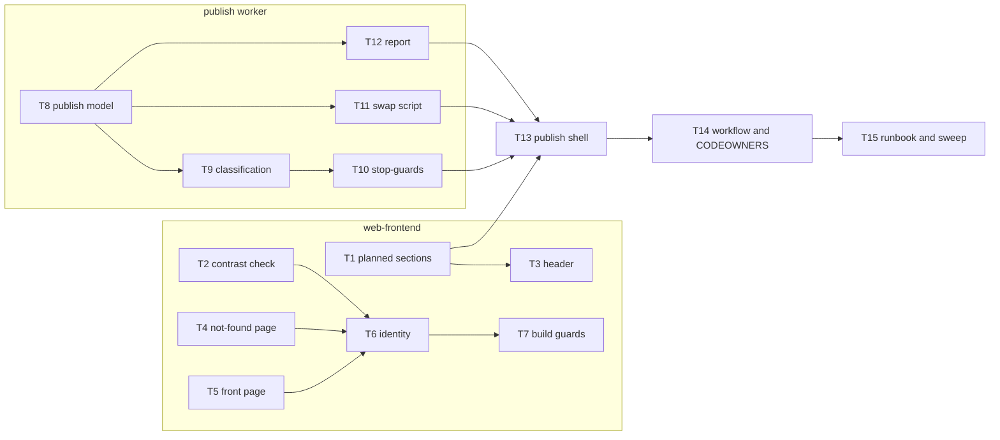

# Epic — clean-starter

> **Spec:** [spec.md](../spec.md) · **Design:** [sad.md](../sad.md) · **Data model:** [data-model.md](../data-model.md) · **API:** none (no endpoint, event or public signature; `api` skipped) · **UX:** [ux-flows.md](../ux-flows.md) · **ADRs:** [adr/](../adr/)

## Goal

Ship a minimal, honest front page in the group's own identity and turn publishing into a guarded
mirror, so that no starter content stays reachable and the live site reflects what the
maintainer publishes without endangering files others rely on in the shared server folder
(spec §2). Every page is readable, self-contained and free of dead ends.

## Scope

- **In:** web-frontend (`src/data`, `src/lib`, `Header`, `404`, front page, tokens, fonts, build
  guards) and the publish worker (`deploy/`: pure planner, remote swap script, encrypted report,
  SSH shell), plus the workflow, CODEOWNERS and the rollout runbook.
- **Out (spec §3):** a final polished identity; a new or redrawn logo; redirects for old starter
  addresses; the full front page (roadmap step 2); real Research/People/Join content (steps 3–6);
  the final domain (D3).

## Task map

Two independent branches (site and worker) that join at T13. Wave 1 starts five tasks in
parallel.

| Wave | Tasks | Note |
|---|---|---|
| 1 | T1, T2, T4, T5, T8 | T4 and T5 share `tests/build.test.ts`, so they are serialized |
| 2 | T3, T6, T9, T11, T12 | T3 is in the `build.test.ts` lane; T9 is in the `plan.ts` lane |
| 3 | T7, T10 | |
| 4 | T13 | worker and navigation join |
| 5 | T14 | |
| 6 | T15 | |

**Serialized lanes (overlapping `files_hint`):** `tests/build.test.ts` → T3, T4, T5, T7 ·
`deploy/plan.ts` + `tests/plan.test.ts` → T8, T9, T10 · `src/styles/contrast-pairs.ts` → T2, T6.

## Tasks

See [tracker.md](./tracker.md) for status. Machine contract: [tasks.json](../tasks.json).

| # | Task | Layer | Blocked by | DoD (short) |
|---|---|---|---|---|
| T1 | [Planned sections + offered-sections helpers](./t01-planned-sections.md) | domain | — | navigation unit tests pass |
| T2 | [WCAG contrast check over declared pairs](./t02-contrast-check.md) | domain | — | contrast test names a failing pair |
| T3 | [Header renders only offered sections](./t03-header-offered-sections.md) | ui | T1 | no dead header link in `dist/` |
| T4 | [Not-found page](./t04-not-found-page.md) | ui | — | `404.html` with `noindex`, nav, link home |
| T5 | [Minimal front page](./t05-front-page.md) | ui | — (needs maintainer copy) | name, paragraph, KTH, contact in `dist/` |
| T6 | [Identity: palette, type, fonts, sign-off](./t06-identity-palette-and-fonts.md) | ui | T2, T4, T5 | contrast passes; sign-off recorded |
| T7 | [Build guards: off-site refs, font budget](./t07-build-guards.md) | tests | T6 | guards pass and fail on planted fixtures |
| T8 | [Publish model + rules files](./t08-publish-model-and-rules.md) | domain | — | parsers tested; real rules files parse |
| T9 | [Planner classification and plan](./t09-plan-classification.md) | domain | T8 | every ownership row tested, off and on |
| T10 | [Planner stop-guards](./t10-plan-stop-guards.md) | domain | T9 | one failing case per guard |
| T11 | [Remote swap script](./t11-remote-swap-script.md) | infra | T8 | temp-folder integration test passes |
| T12 | [Publish report (public + encrypted)](./t12-publish-report.md) | infra | T8 | round-trip; summary leaks no path |
| T13 | [Publish shell over SSH](./t13-publish-shell.md) | app | T1, T10, T11, T12 | end-to-end via local executor |
| T14 | [Workflow + CODEOWNERS](./t14-workflow-and-codeowners.md) | wiring | T13 | main-only deploy, no `scp-action` |
| T15 | [Runbook + repository sweep](./t15-rollout-runbook-and-repo-sweep.md) | docs | T14 | rollout documented; repo clean |

## AC coverage

| AC | Tasks |
|---|---|
| AC-01 | T9, T13 |
| AC-02 | T4 |
| AC-03 | T1, T3 |
| AC-04 | T1, T13 |
| AC-05 | T6, T7 |
| AC-06 | T2, T6 |
| AC-07 | T9, T12 |
| AC-07b | T8, T9 |
| AC-08 | T14, T15 |
| AC-09 | T12, T14 |
| AC-10 | T9, T11, T13 |
| AC-11 | T9, T11 |
| AC-11b | T10 |
| AC-12 | T8, T10 |
| AC-13 | T9, T13 |
| AC-14 | T15 |
| AC-15 | T5 |

## Risks / Hard rules

- **Deletion stays off until rollout step 4** (sad §7). No task switches it on; that is a reviewed
  rules change by the maintainer after the probe publish.
- **Protected and unknown files are never changed** (AC-11, AC-13; sad §8 Ownership).
- **The listing never leaves the encrypted report** (ADR-0004, sad §8 Logging and disclosure).
- **No new npm dependency, no third-party deploy action** (ADR-0002, `CLAUDE.md`).
- **Tokens only; the logo is unchanged** (repo ADR 0003, spec §3).
- **Numbers verbatim from spec §6:** ≥ 4.5:1 / ≥ 3:1 contrast, 0 third-party requests, ≤ 10 min
  merge-to-live, ≤ 5 s mixed window, ≤ 20 routine removals, ≤ 100 KB fonts per page.
- **Inputs from the maintainer:** front-page copy (T5), font choice and before/after sign-off (T6),
  repository settings and GPG key (T15 runbook, rollout step 1).
