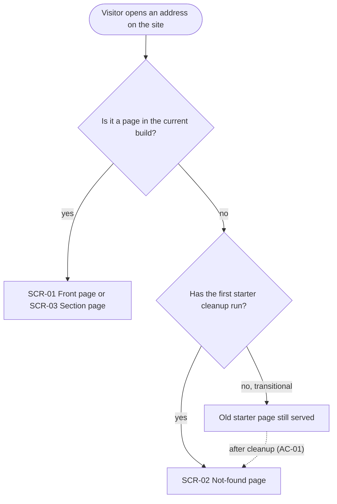
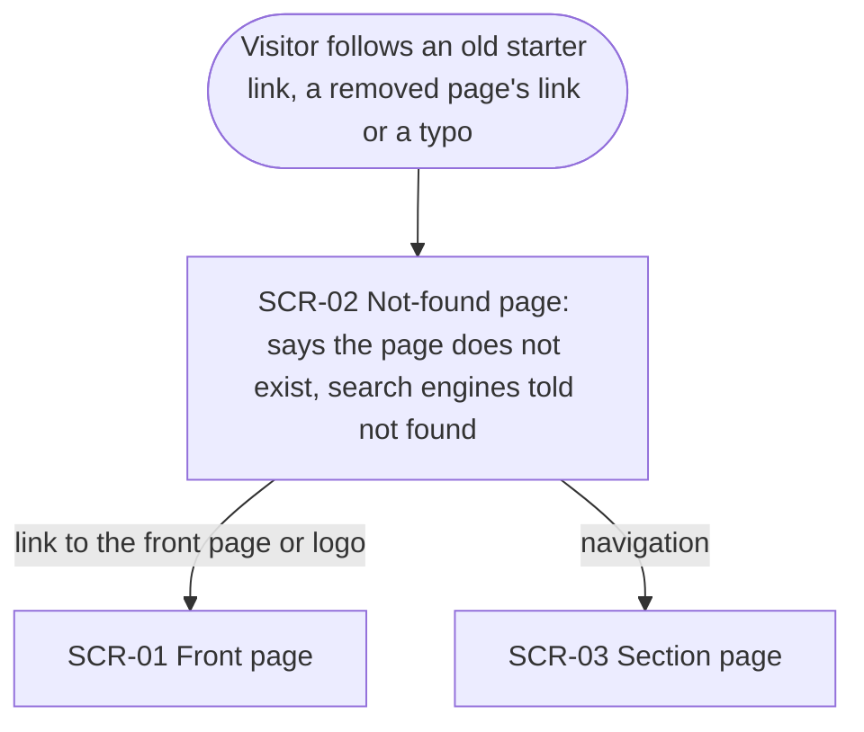
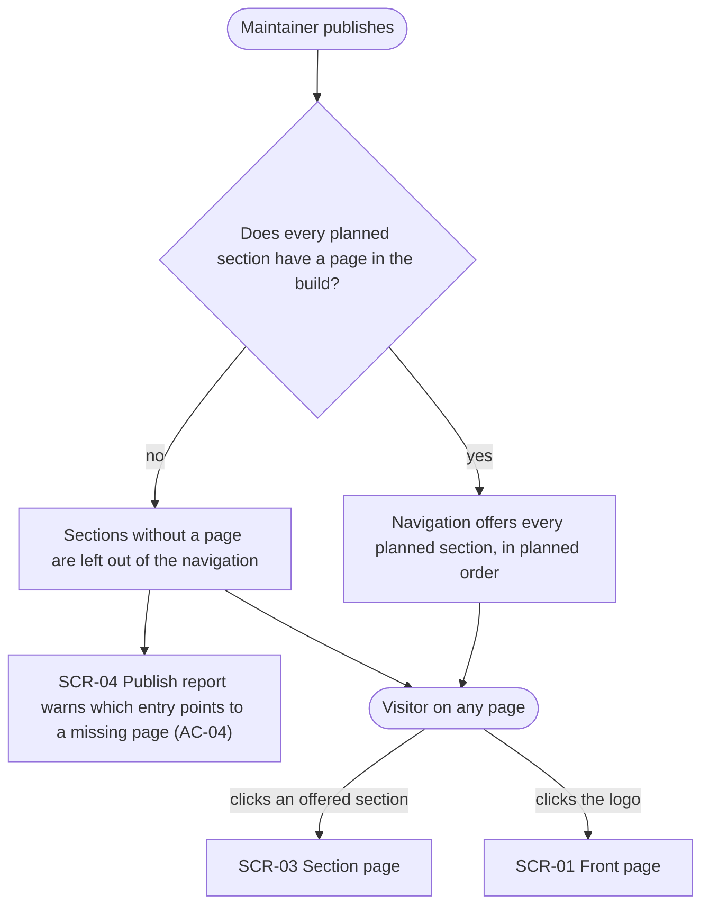
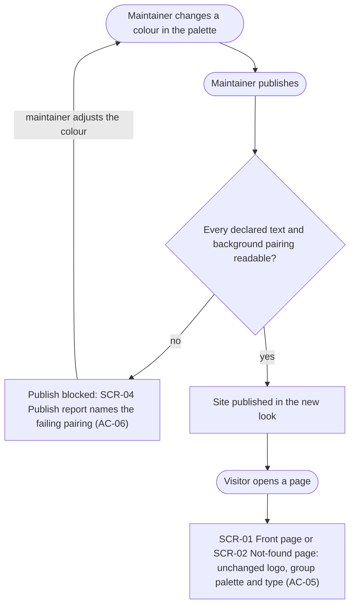
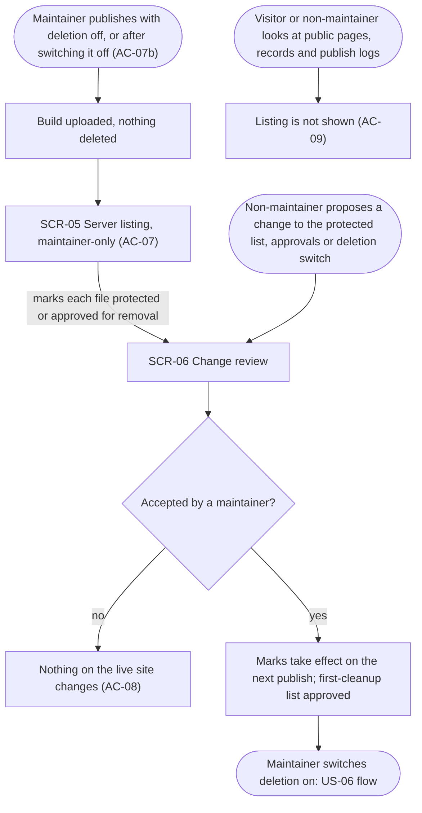
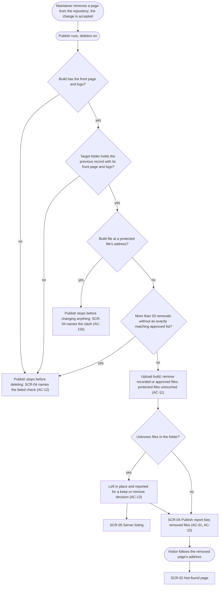
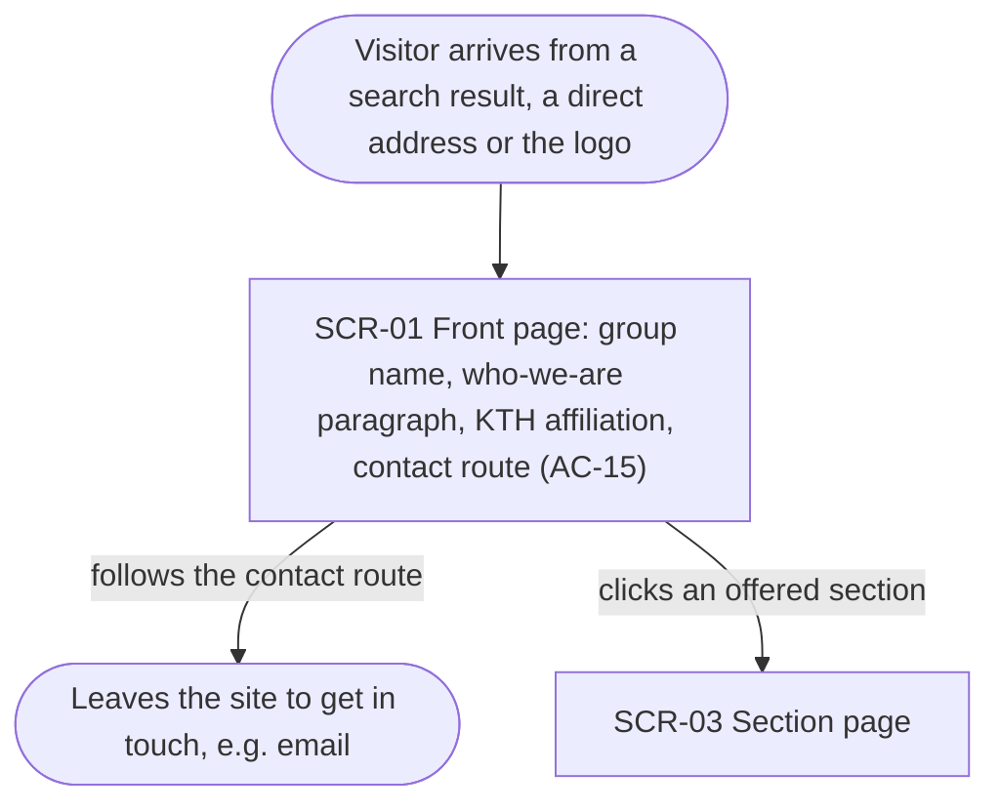

# UX flows — clean-starter

> User flows for every UI-touching §4 user story, produced by `ux-flows` (after `clarify`, before
> `design`) and read by `design` (evidence for the target-surface + UI-architecture decisions),
> `sequences` (UI-driven flows align on SCR ids), `screens` (details every inventory row) and
> `plan-tests` (the e2e-through-UI paths). **Always markdown + mermaid `flowchart`**, whatever the
> design tool — this artifact is flow-altitude, not visual design.

## Platform decisions

- **Posture:** responsive-both — visitor pages work equally on phone and desktop (prospective
  students often arrive on a phone; funders and peers read on a laptop). This is the default from
  `docs/design-system.md`; this feature does not deviate.
- **Two surfaces, two audiences.** Visitors move between public site pages (SCR-01 to SCR-03).
  The maintainer never uses the site to publish: their touchpoints are the publish report, the
  server-folder listing and the review of proposed changes (SCR-04 to SCR-06), all outside the
  public site. Where those are delivered (and how they stay maintainer-only) is a `design` input.
- **Navigation is a region on every page, not a screen.** It offers only planned sections whose
  page exists (AC-03), plus the logo as the way back to the front page.
- **No dead ends.** Every visitor screen has the navigation and a route to the front page;
  the not-found page is the landing spot for every address the site does not have.
- **Front-page contact leaves the site** (e.g. an email link); there is no contact form in this
  feature.

## Screen inventory

| ID     | Screen             | Purpose                                                                                                                                                                                                | Entry                                                                                        | Exit                                                                                           |
| ------ | ------------------ | ------------------------------------------------------------------------------------------------------------------------------------------------------------------------------------------------------ | -------------------------------------------------------------------------------------------- | ---------------------------------------------------------------------------------------------- |
| SCR-01 | Front page         | Who the group is, where it sits at KTH, how to get in touch (AC-15), in the group's identity (AC-05)                                                                                                   | direct address, search result, logo on any page, link on SCR-02                              | a section via navigation (SCR-03), the contact route (off-site)                                |
| SCR-02 | Not-found page     | Says the page does not exist, in the group's look, and leads back (AC-02)                                                                                                                              | any address the site does not have: old starter link, removed page, typo                     | front page (SCR-01), a section via navigation (SCR-03)                                         |
| SCR-03 | Section page       | A published planned section (Research, People or Join/Contact once each exists); its content is roadmap steps 3–6, this feature only routes to it                                                      | navigation on any page                                                                       | another section, front page via logo                                                           |
| SCR-04 | Publish report     | Maintainer-only outcome of one publish: uploaded / removed files, the check that stopped it, warnings (missing navigation page, failing colour pairing), unknown files awaiting a decision | every publish                                                                                | nothing to do, or a fix and a new publish, or a keep-or-remove decision (SCR-05)               |
| SCR-05 | Server listing     | Maintainer-only list of every server-folder file the build does not contain, to mark protected or approve for removal (AC-07)                                                                          | a publish with deletion off; unknown files reported by any publish (AC-13)                   | marks proposed as a change (SCR-06)                                                            |
| SCR-06 | Change review      | A proposed change to the protected list, removal approvals or deletion switch, waiting for a maintainer to accept it (AC-08)                                                                           | a maintainer or non-maintainer proposes the change                                           | accepted by a maintainer and published, or left waiting / declined                             |

## Flows

### Flow: US-01 — See only real group content

A visitor opens any address. If it's a page in the current build, they get the front page or a
section page. If it isn't, then after the first starter cleanup they get the not-found page. Until
that cleanup runs, an old starter address still shows the old starter page. That is the
transitional state the §7 KPI gives 7 days to close. Once the cleanup has run, the same address
shows the not-found page (AC-01).

### Flow: US-02 — Land safely on a missing page

A visitor follows an address the site does not have. That could be an old starter link, the
address of a page that was removed, or a typo. They land on the not-found page, in the group's
look, which says the page does not exist and tells search engines the same. From there the
front-page link or the logo takes them to the front page, and the navigation takes them to any
published section. The maintainer has confirmed that the KTH server serves the site's own
not-found page for every missing address within the site's subdomain (`oden.abe.kth.se`), so
visitors there never see a generic server error page.

### Flow: US-03 — Navigate only to real sections

On each publish, the navigation offers each planned section, in the planned order, but only if its
page is in the build (AC-03). A planned section without a page, whether not written yet or a
mistyped address, is left out. The publish still goes ahead, and the publish report warns the
maintainer which entry points to a missing page (AC-04). A visitor on any page therefore sees only
sections that exist: clicking one opens that section, and the logo returns them to the front page.
At launch the Research, People and Join/Contact pages don't exist yet, so the navigation offers none
of them.

### Flow: US-04 — Recognise the group's identity

When the maintainer changes a palette colour and publishes, the readability check runs over every
text and background pairing the site declares it uses. If any pairing falls below the minimum, the
publish is blocked and the report names the failing pairing (AC-06). The maintainer adjusts the
colour and tries again. Once every pairing passes, the site is published. A visitor opening the
front page or the not-found page sees the unchanged logo with the group's palette and type (AC-05).
The before/after screenshot sign-off is a one-time manual acceptance and appears in no flow.

### Flow: US-05 — Review the server before deletion

When the maintainer publishes with deletion off, or after switching it off again (AC-07b), the
build is uploaded and nothing is deleted. The maintainer then receives the server listing through a
maintainer-only route (AC-07). They mark each file as protected or approved for removal and propose
those marks as a change. That change waits in review, and so does any change a non-maintainer
proposes to the protected list, the approvals or the deletion switch. Until a maintainer accepts it,
nothing on the live site changes (AC-08). Once accepted, the marks take effect on the next publish,
and they form the approved list for the first cleanup. Switching deletion on then leads into the
US-06 flow. Separately, anyone looking at the public pages, records or publish logs never sees the
listing (AC-09).

### Flow: US-06 — Publish mirrors the repository

The maintainer removes a page from the repository, the change is accepted, and a publish runs with
deletion on. Before it deletes anything, four checks run in order. Does the build contain the front
page and the logo? Does the target folder hold the previous publish's record, with the front page
and logo that record lists? Is there a build file at a protected file's address? Would the publish
remove more than 20 files without an approved list that matches exactly? A missing front page or
logo, a wrong folder, or too many removals stops the publish before any deletion, and the report
names the failed check (AC-12). A clash with a protected address stops the publish before anything
on the server changes (AC-11b). If every check passes, the build is uploaded, files a previous
publish recorded or the maintainer approved are removed, and protected files stay untouched
(AC-11). Files the site never published and nobody reviewed are left in place and reported for a
keep-or-remove decision (AC-13). The publish report lists what was removed (AC-01 for the first
starter cleanup, AC-10 for later removals). A visitor following the removed page's address then
lands on the not-found page.

### Flow: US-08 — Learn the basics from the front page

A visitor reaches the front page from a search result, by typing the address, or through the logo
on any page. They see the group name, a short who-we-are paragraph, the KTH affiliation and a way to
get in touch (AC-15). Following the contact route takes them off the site, for example to email,
and the navigation takes them to any published section.

### Out of scope

- **US-07 — Repository free of starter notices:** this is about the repository's files, so it has
  no screen and no movement to draw. Covered by AC-14 in the spec.

## AC coverage

| AC     | Shown by                                                                 | Notes                                                                    |
| ------ | ------------------------------------------------------------------------ | ------------------------------------------------------------------------ |
| AC-01  | Flow US-01 → "after cleanup" branch; Flow US-06 → SCR-04 removed list    | First starter cleanup is the US-06 flow with the first-cleanup list      |
| AC-02  | Flow US-02 → SCR-02                                                      | KTH server serves the site's own not-found page within its subdomain (confirmed)   |
| AC-03  | Flow US-03 → "yes" branch, navigation offers planned sections with pages |                                                                          |
| AC-04  | Flow US-03 → "no" branch, entry left out + warning in SCR-04             | Warning only, the publish goes ahead                                     |
| AC-05  | Flow US-04 → SCR-01 / SCR-02 in the group look                           | Screenshot sign-off is one-time and manual, not drawn                    |
| AC-06  | Flow US-04 → "no" branch, publish blocked, SCR-04 names the pairing      |                                                                          |
| AC-07  | Flow US-05 → SCR-05 Server listing                                       |                                                                          |
| AC-07b | Flow US-05 → entry "after switching it off"                              |                                                                          |
| AC-08  | Flow US-05 → SCR-06, "not accepted" branch                               |                                                                          |
| AC-09  | Flow US-05 → public-records branch, listing not shown                    |                                                                          |
| AC-10  | Flow US-06 → SCR-04 removed list → SCR-02 for the removed address        |                                                                          |
| AC-11  | Flow US-06 → upload/remove node, protected files untouched               |                                                                          |
| AC-11b | Flow US-06 → protected-address clash branch                              |                                                                          |
| AC-12  | Flow US-06 → three stop branches into the shared stop node               | Missing front page or logo, wrong folder, removals above the limit       |
| AC-13  | Flow US-06 → unknown-files branch → SCR-05                               | Re-reported on every publish until decided                               |
| AC-14  | N/A: repository content, no UI (US-07)                                   |                                                                          |
| AC-15  | Flow US-08 → SCR-01                                                      | Copy is a §8 open question (maintainer writes it)                        |
