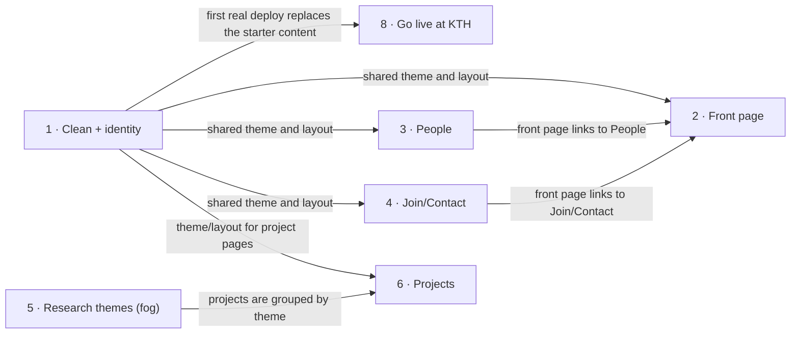

# Roadmap — odenlabs-website

> **A decomposition, not a promise.** The overall idea broken into incremental steps: what each
> step is, where it comes from, how big it is — or that nobody has looked at it yet — and in which
> order, and parallel lanes, we walk them. **No dates** (except shipped history), **no scores** —
> order is the prioritization. The *solution* for any step lives in its `docs/features/<slug>/`
> spec, not here.

## Destination

A small English-only site with the research group's own identity is live at KTH, showing visitors what the group researches, who is in it and how to join, and the owner can publish a real update in minutes.

## Steps

| # | Step | Source | Size | Status |
|---|---|---|:---:|---|
| 1 | Clean the starter and set the group's identity (demo content gone, logo/theme kept or restyled) | idea-brief.md §1 Raw idea; §8 Open questions | M | idea |
| 2 | Front page "who we are" with equal paths to Research, People and Join/Contact | idea-brief.md §7 Recommendation | M | idea |
| 3 | People pages: members and bios | idea-brief.md §7 Recommendation | M | idea |
| 4 | Join / Contact page | idea-brief.md §7 Recommendation | S | idea |
| 5 | Research themes as the site's spine → see [Not yet specified](#not-yet-specified) | idea-brief.md §7 Recommendation | fog | idea |
| 6 | Projects pages grouped under each theme | idea-brief.md §7 Recommendation | M | idea |
| 7 | Automatic publications import → see [Not yet specified](#not-yet-specified) | idea-brief.md §6 Risks | fog | idea |
| 8 | Go live at KTH: confirm the existing SSH deploy to oden.abe.kth.se replaces the starter with the real site | idea-brief.md §6 Risks | S | idea |

## Not yet specified

| Area | What we'd have to learn | Blocks | How it gets sharpened |
|---|---|:---:|---|
| Research themes (step 5) | Which 3–5 themes define the group, and whether the group agrees on them | 5 | A conversation with the owner (and group), seeded by the four areas on the old urbant.org Research page (energy systems, smart cities, circular economy, sustainable urban development) |
| Publications import (step 7) | Which source feeds it (ORCID, DiVA, Google Scholar) and whether its data is complete enough | 7 | Recon pass: sample each source for the group's authors |

## Out of scope

- Blog / news feed — stale news is worse than none; revisit once a posting habit exists.
- Swedish or any second language — doubles every content edit.
- Member-editable profiles or login-based editing — one maintainer, no accounts to secure.
- Internal member area or resources — Notion already covers it.
- Fully KTH-branded design — the site carries the group's own identity.

## Open decisions

| # | Question | Type | Owner | Blocks |
|---|---|:---:|:---:|:---:|
| D1 | Which 3–5 research themes define the group? | grilling | human | 5 |
| D2 | Which source feeds publications, and is its data good enough? | research | agent | 7 |
| D3 | Who owns the KTH virtual server, and is oden.abe.kth.se the final domain? | grilling | human | 8 |
| D4 | Where does the first batch of real content (bios, photos) come from, given members must supply some? | grilling | human | 3 |
| D5 | Keep, restyle or replace the existing logo and blue theme? | grilling | human | 1 |

## Decisions so far

- English-only, single maintainer, hosted at KTH, built around research themes → [`idea-brief.md §7`](idea-brief.md)
- Blog, second language, member editing, internal area and full KTH branding are out → [`idea-brief.md §5`](idea-brief.md)
- Hosting is oden.abe.kth.se via GitHub Actions SSH copy, all four secrets set; recon done → [`.github/workflows/publish.yaml`](../.github/workflows/publish.yaml), [`config/_default/hugo.yaml`](../config/_default/hugo.yaml)

## Dependency graph

## Execution path

Fog steps (5, 7) have no wave; their recon passes run alongside. Hosting recon is done, so step 1 is unblocked.

| Wave | Steps | Zone per step (why parallel-safe) | Unlocks |
|:---:|---|---|---|
| 1 | 1 | 1: `config/_default`, `assets`, demo content under `content/` | 2, 3, 4, 6, 8 |
| 2 | 3 ∥ 4 | 3: `content/people`, `content/authors` · 4: `content/contact` (disjoint) | 2 |
| 3 | 2 | 2: `content/_index.md` | — |
| 4 | 6 ∥ 8 | 6: `content/project` (new) — after recon of step 5 · 8: `.github/workflows` (disjoint) | — |

## Shipped

| Step | Shipped | Link |
|---|---|---|
